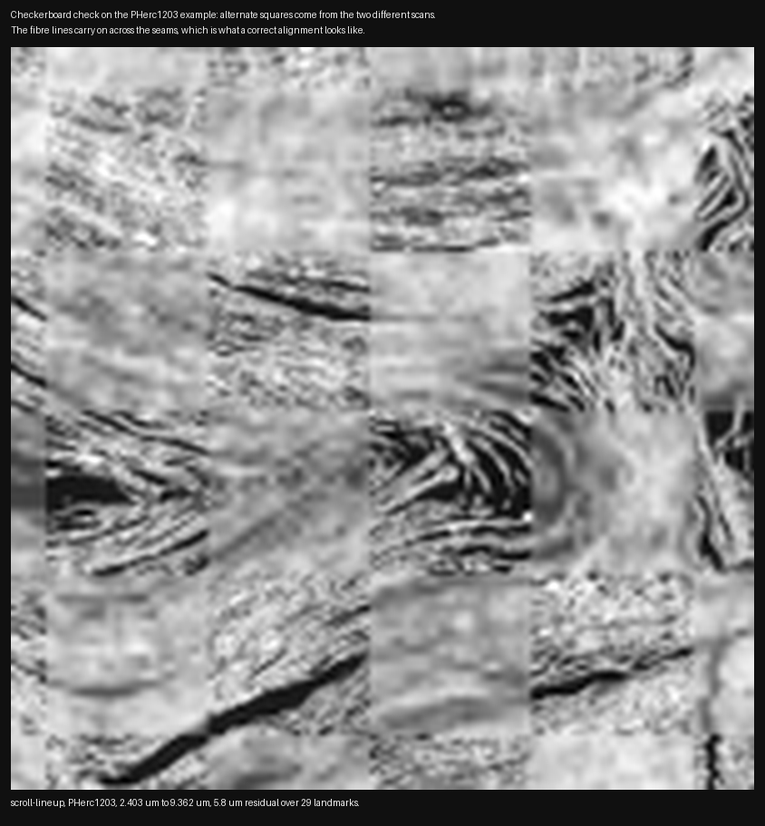
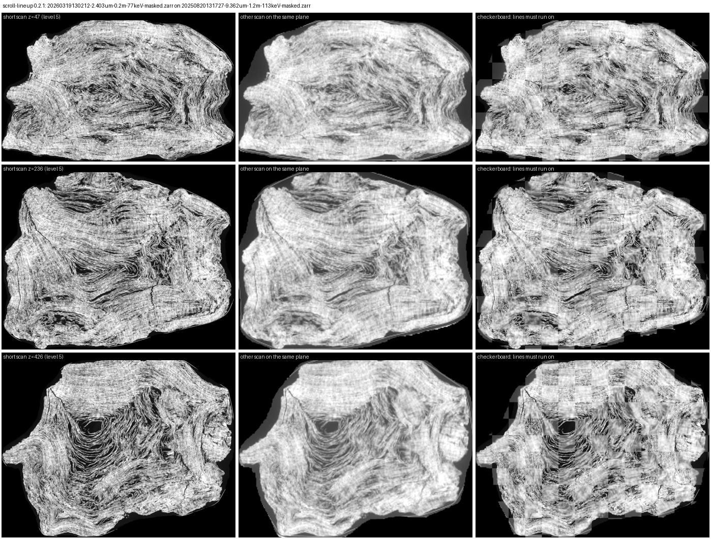

# scroll-lineup: line up two CT scans of the same scroll

[](https://github.com/kadenpool/scroll-lineup/actions/workflows/ci.yml)

One command. Two public OME-Zarr volumes of
the same scroll in, a `transform.json` in
the Vesuvius Challenge's own format out,
plus a report with every intermediate number
and a picture to check by eye. CPU only, no
GPU, no hand-placed landmarks.

```
python scroll_lineup.py MOVING_URL FIXED_URL --out DIR [--write-inverse]
```

I was doing ink detection and kept hitting the same wall. The fine scan is where you can actually see something,
but the First Letters rules only accept evidence from the 9.362 um scan, and I had no way to ask where a spot in one sits
in the other. So I lined them up by hand, trusted it, and found out later it was 29 um off. I wanted something that would
do that for me and show its working.

Version 0.2.1 (`python scroll_lineup.py
--version`). MIT licensed. Built with an LLM
coding assistant (Claude Code) under my
direction.

## Why

Several scrolls in the open data have more
than one scan: a whole-scroll scan at about
9 um and a sharper partial scan at about 2.4
um. To use a surface found in one on the
other you need the transform between them.
The challenge publishes one for some pairs
and none for others. This tool looks for one
from the two volumes alone, grades itself
against the published ones, and says when it
has not found one: 13 PASS, 9 WEAK and 4
FAIL over all 26 official pairs, nothing
excluded.



*Alternate squares come from the two
different scans. The fibre lines carry on
across the seams, which is what a correct
alignment looks like. This is a zoom of the
qc image the tool writes on every run.*

## The most useful thing in here, if you only read one part

Grading itself against the published
transforms turned up something about the
published transforms.

25 of the 26 official transforms in
`metadata.json` ship the landmark pairs they
were built from. Applying each matrix to its
own landmarks should land on its own
targets. **Four of the 25 miss by more than
30 um**, the worst by 123 um RMS with one
point 212.5 um out.

| object | moving to fixed (um) | RMS um |
|---|---|---|
| PHerc1667 | 1.129 to 2.399 | **123.3** |
| PHerc0332 | 2.399 to 7.91 | **103.1** |
| PHerc1667 | 2.399 to 7.91 | **53.6** |
| PHercParis4 | 45.532 to 7.91 | **35.1** |

The other 21 sit between 0.0 and 25.3 um, so
the four are separated by a gap rather than
by where a line was drawn.

**But a residual does not say the matrix
could be better.** The audit also fits the
best affine each landmark set allows. For
24 of the 25 the published matrix already is
that fit, so three of those four cannot be
improved by any affine and the thing to look
at is their landmarks. The exception is
PHerc1667 1.129 to 2.399: 123.3 um where the
best affine on the same six points is
2.2 um. What that costs a surface carried
through it is measured in
[villa#1843](https://github.com/ScrollPrize/villa/issues/1843).

```
python audit/audit_landmarks.py
```

One file, about four seconds, no dependency on this
tool, reading only their own published data.

**Read this before you read the table as a
boast.** It measures a transform against the
points it was *fitted to*, which is the
easiest test a fit can be given. This tool's
own numbers are measured the hard way, on
points it never saw, and on that basis
**ours is worse than the official transform
on 24 of the 25 pairs that publish
landmarks.** The one pair where ours wins is
PHerc1667 1.129 to 2.399, and on PHerc0332
ours is 104 um from the same six points the
official matrix misses by 103. So this is
not a claim to be better. It is a claim that
four published transforms do not do the one
thing their own landmarks say they should.

**Why that matters:** a surface carried
between scans on one of those four lands
somewhere the landmarks say it should not,
and nothing in the pipeline says so.
`audit/` has the detail and the same caveat.

**And the catalogue is not the only copy.**
18 of the 26 transforms are also stored as a
`transform.json` next to their volume. 17
match the catalogue exactly. One does not:
for PHercParis4 45.532 to 7.91 um the
per-volume copy is a different matrix that
misses its own landmarks by 518.3 um RMS,
where the catalogue copy misses by 35.1.
Which one you get depends on which file you
read. `audit/compare_copies.py` checks all
of them in about 20 seconds.

## Install

Python 3.9 or newer, and

```
pip install numpy scipy fsspec s3fs Pillow
```

`pip install -r requirements.txt` is the
same five with minimum versions. Add
`numcodecs` for a compressed volume: most
public masked zarrs store raw chunks, but
`PHerc0172`'s 7.910 um pair includes one
that is blosc-compressed. On Debian and
Ubuntu, `python3 -m venv` needs `sudo apt
install python3-venv` first.

### Check it works before you download anything

```
python tests/test_offline.py
```

Seconds, no network. It re-derives every
number in the tables below from the
committed run data and checks the geometry
the tool rests on.

### The cheapest real run

```
B=s3://vesuvius-challenge-open-data/PHercMANBp/volumes
python scroll_lineup.py $B/20260427100434-1.129um-0.2m-59keV-masked.zarr \
                        $B/20251216152116-2.399um-0.2m-78keV-masked.zarr --out out_MANBp
```

**482 MB and 3.8 minutes**, and the pair the
automated checks run on every push, so it is
the one with the best-tested answer to
compare against in `results/v9_MANBp/`.
It is not the very cheapest run in the
tables: `r3_0500hi` reads less (201 MB) and
`r5_0332b` finishes faster (1.0 min), but
the first of those is a pair the tool fails
on and neither is exercised by the checks.
Add `--stop-after g1` to any run to stop
after the first stage, which tells you
whether the tool is finding your scroll at
all before you wait for the rest. That stage
took under a minute on 12 of the 21 pairs
and 1 to 2 minutes on four more, but on the
five that need the slow 2D search it is the
slow part, 5 to 14 minutes.

A pair reads 0.2 to 2.1 GB straight from the
public bucket, streams it through memory,
and takes 1 to 17 minutes on 8 cores: the
range over the twenty-one pairs in
`VALIDATION.md`. Peak resident memory was
measured on nine of them and runs 1.0 to 3.5
GiB on eight, the exception being the 0.55 um
partial-view pair at 8.2 GiB, which is also
the pair the tool fails on. The PHerc1203
example peaks at 2.6 GiB.

`s3://` and `...s3.amazonaws.com/...zarr/`
URLs become anonymous S3 reads. Other
`https://` hosts, such as the 2023 scans on
`https://data.aws.ash2txt.org/samples/...`,
are read over plain HTTP. **Anything that is
not a URL is treated as a path on your own
disk**, so a zarr you hold locally works the
same way, with no bucket involved.

Worth knowing if you are working from the
challenge's `metadata.json`: the catalogue
spans two hosts. Three of its official
transforms name a volume that is not in the
S3 bucket at all, and you only find it by
reading the access root the metadata gives
rather than assuming one bucket.

## Example: PHerc1203

PHerc1203 has a 9.362 um scan of the whole
scroll and a 2.403 um scan of 36 mm of it,
and the challenge publishes no transform
between them.

```
B=s3://vesuvius-challenge-open-data/PHerc1203/volumes
python scroll_lineup.py $B/20260319130212-2.403um-0.2m-77keV-masked.zarr \
                        $B/20250820131727-9.362um-1.2m-113keV-masked.zarr --out out_1203 --write-inverse
```

About 200 s and 1.26 GB read. Confidence
`HIGH`. At the finest block level (19 um),
30 of 36 blocks matched and 29 were used in
the fit, at a median block correlation of
0.98 and a residual of 5.8 um RMS. The sharp
scan sits with its first slice at 9.362 um
voxel z 7935.3 (74.29 mm along the scroll),
scale 0.03 % under nominal, tilt 0.09
degrees. That whole run is in
`examples/pherc1203/`. `bash run_1203.sh`
reruns it and then the comparison below: 6
min 12 s end to end, peak 2.6 GiB
(`VALIDATION.md`, section 5).

**Reproducibility.** The tool is
deterministic at a given `--seed` (default
0). This command has been run five times
over four days, three from a clean clone
into an empty virtual environment, and all
five gave a byte-identical `transform.json`
and `transform_inverse.json`:

```
e278bd0e692ba9b47f531d51d93e2cd6  examples/pherc1203/transform.json
1751e7551fd456662dbd924f87f895bc  examples/pherc1203/transform_inverse.json
532261b826fdc4627e42aeb90191d6d0  examples/pherc1203/qc.png
```

All five resolved to the same package
versions, so byte-identity is a claim about
one software stack. Across stacks the md5
moves and the answer holds: on Python 3.9
with numpy 2.0.2 and scipy 1.13.1, on arm64
macOS instead of x86-64 Linux, the largest
disagreement anywhere in the volume is
0.000259 um (`VALIDATION.md`), on `r7_1667b`.

**Against the two public PHerc1203
registrations** (`compare1203.py`, 5000
points in scroll material): ours agrees with
7jycwjmbfn-eng's block-matching registration
to 3.5 / 5.2 / 6.0 um (median / 95th / max),
and differs from flummoxjr's by 29 um
median, split evenly between height (18 um)
and across (21 um). Of 48 held-out image
cubes tried, 45 to 46 matched for each
transform, and on those the correction still
needed is 4.6 um
(ours), 5.0 um (7jycwjmbfn-eng), 33 um
(flummoxjr). My own first attempt at this
pair, by hand before this tool existed, sits
29 um from this one and needs 27 um on the
same cubes. That is why the tool exists.

Two transforms agreeing shows they are
consistent. Whether either is right is a
separate question, and the seating check
below is the test for it.

## Output

| file | what |
|---|---|
| `DIR/transform.json` | `schema_version`, `fixed_volume`, `transformation_matrix` (3x4), `fixed_landmarks`, `moving_landmarks`: the same keys as the official `<volume>.zarr/transform.json` files |
| `DIR/transform_inverse.json` | with `--write-inverse`: the same transform the other way round (fixed to moving) |
| `DIR/report.json` | every intermediate number: search candidates and scores, block matches, residuals, the transform decomposed into scale / rotation / tilt / mirror / upside-down, and a `confidence` verdict |
| `DIR/qc.png` | three cross-sections of the shorter scan, the other scan on the same plane through the transform, and a checkerboard of the two. Look at it. |

**Convention, as in the official files.**
`transformation_matrix` maps a MOVING
level-0 voxel `(x, y, z)` to a FIXED level-0
voxel `(x, y, z)`: `fixed = M[:, :3] @
moving + M[:, 3]`. The order is x, y, z,
while zarr arrays are indexed `[z, y, x]`.
The landmarks are the block matches used in
the final fit, in the same coordinates, so
anyone can check or re-fit the file.



*The whole qc image: three slices through
the scroll, each showing the first scan, the
second scan on the same plane, and the
checkerboard.*

## Method

1. **G1, whole-scroll search, about 300
   um.** Five cross-sections of the shorter
   scan become polar signatures around their
   material centroid, so one FFT scores all
   360 rotations, both mirror images and
   upside-down placements at once against
   the whole taller scan. Five heights at a
   fixed spacing pin the height. A full 2D
   search is added when the winner is close,
   or when the shorter scan sees only part
   of the cross-section, as the 1.129 um and
   0.55 um tiles do.
2. **G2, re-score the best answers, about
   150 um.** Full 2D image matching of the
   inner detail at the five heights,
   refining rotation to 0.25 degrees, height
   and height scale. Winner and margin over
   the runner-up are reported. The xy drift
   with height gives the tilt.
3. **B, 3D block matching, about 75, 37 and
   19 um.** Dozens of cubes of the shorter
   scan are matched in the other by masked
   normalised cross-correlation with
   sub-voxel peaks. Each match is a landmark
   pair; a 12-parameter affine is fitted
   with outlier rejection, two rounds per
   resolution. The search box widens (x2,
   x4) when too few cubes match.
4. **Confidence.** `HIGH`, or `CHECK` plus
   the reasons: small G2 margin, too few
   blocks, block residual over 30 um. What
   it has and has not caught is under
   Limits, below.

Pyramid levels are 2x2x2 means, so level-L
voxel `i` is centred on level-0 coordinate
`2^L i + (2^L - 1)/2`. Checked against the
data: on a 128-cubed block of the PHerc1203
9.362 um scan, level 1 equals the 2x2x2 mean
of level 0 to within 8-bit rounding, largest
difference 0.50 grey levels, mean 0.25, r =
0.99995. Getting that half-voxel offset
wrong costs 4.7 um on a 9.362 um scan, the
size of the residuals below. Sizes, search
spaces and reasons: `docs/method.md`.

## How good is it: graded against the challenge's own transforms

The rule was fixed before any validation
pair ran (`PREREG.md`). Error = distance
between where ours and the official
transform put the same point, over 4000
random points in scroll material. PASS =
95th percentile within 30 um (about 3 voxels
of a 9.4 um scan, 12 of a 2.4 um scan); WEAK
= within 150 um, right place, too coarse to
render a segment from the other scan; FAIL =
worse, or no answer. The official transforms
come from the open-data `metadata.json`.

Twelve official pairs on 7 objects, 1.129 to
9.362 um, including the 2023 7.91 um scans
(turned over, 81 and 121 degree turns), 176
and 178 degree turns, a 14 degree tilt, and
1.129 um tiles that see only part of the
cross-section. Eight of the twelve ran on
0.2.1 and four on 0.2.0, which the `tool`
column records per row. 0.2.1 widened when
the slow 2D search runs: it now also fires
when the quick search has no clear winner,
not only when the field of view is partial.
The field that records whether that would
have happened was added in 0.2.1, so **it
cannot be checked from the committed data
whether three of the four 0.2.0 rows would
move on a rerun. The fourth, `n3_0814roi`,
already took the slow path on the old
trigger, so the new one is redundant there.** Two of those four are the
upside-down pairs and one is the 14 degree
tilt, so those three capabilities rest on
runs the shipped version has not produced:

| pair (moving to fixed, um) | what the official transform says | error vs official: median / 95th pct / max (um) | verdict | held-out image cubes must move: ours / official (median um) |
|---|---|---|---|---|
| PHerc0139 2.403 (scan 20250820105138) to 9.362 | plain | 43 / 107 / 152 | WEAK | 21 / 42 |
| PHerc0009B 8.64 to 2.401 | 2.8 deg tilt | 15 / 37 / 153 | WEAK | 6 / 18 |
| PHerc0814 2.399 to 9.362 | 176 deg turn | 13 / 36 / 53 | WEAK | 9 / 18 |
| PHerc0139 2.403 (scan 20250822062710) to 9.362 | plain | 12 / 24 / 33 | PASS | 9 / 17 |
| PHerc0139 2.399 (scan 20260102150214) to 9.362 | 178 deg turn | 18 / 31 / 38 | WEAK | 14 / 22 |
| PHerc0500P2 4.317 to 2.215 | plain | 18 / 45 / 68 | WEAK | 8 / 22 |
| PHerc0500P2 2.215 to 9.362 | 14 deg tilt, 163 deg turn | 7 / 33 / 39 | WEAK (flagged CHECK; placement right) | 6 / 9 |
| PHercMANBp 1.129 to 2.399 | plain | 6 / 13 / 27 | PASS | 10 / 10 |
| PHerc1667 2.399 to 7.91 (2023) | upside down, 81 deg turn, 4 deg tilt | 14 / 24 / 34 | PASS | 8 / 21 |
| PHerc0332 2.399 to 7.91 (2023) | upside down, 121 deg turn, 2 deg tilt | 37 / 69 / 87 | WEAK | 9 / 45 |
| PHerc0814 1.129 to 2.399 | partial view | 4 / 8 / 12 | PASS | 5 / 6 |
| PHerc0139 1.129 to 2.399 | partial view | 5 / 7 / 9 | PASS | 5 / 4 |

Right placement 12 of 12; 5 PASS, 7 WEAK, 0
FAIL; median error 4 to 43 um. Every
per-pair output is in `results/<pair>/`:
transform, official transform, report,
validation numbers, image checks, `qc.png`,
log. `results/table.md` is that folder
regenerated by `summarize.py`, with more
columns. Re-running a row is one command:
`bash run_validation.sh` takes `pairs.txt`,
or any subset of it.

**What the WEAK verdicts mean.** In all 7,
the held-out image cubes need less
correction under our transform than under
the official one (right-hand column).

**Do not put weight on that.** The referee
is biased towards us in a way that is easy
to miss: `datacheck.py` chooses where to put
its test cubes by mapping candidate points
through the **first** transform it is given,
and `run_validation.sh` passes ours first
on that call. (It passes the official one
first on the separate at-landmarks call,
which is therefore not affected.) So the cubes sit where our transform
says there is material, and the official one
is then scored on our chosen ground. Across
all 21 pairs it prefers ours 16 times and
the official 3 times, and on the remaining
two it produced no comparable blocks at all,
so it made no call. Every one of those three
official wins is on a pair we already pass,
and the two it could not judge are the two
we fail. **So it has never once called
against us on a pair that was wrong.**
The sampling is ours, so treat the
column as weak evidence at best, and do not
let it soften a verdict. Two WEAKs have a
visible cause. For PHerc0332 the official
transform's own landmarks sit 103 um RMS off
its own matrix, though ours sit 104 um off
the same six points, so that is a hard
region for both of us and not a defect in
the reference. For PHerc0139 2.403 to
9.362 (Aug 2025) the two scans bend, which
shows in our own fit as the worst block
residuals in the table, 21.7 um RMS against
5 to 15 everywhere else
(`results/v2_0139a/report.json`,
`blocks[-1]`). Verdicts are kept exactly as
the pre-set rule gives them.

**How blind this was.** Two rounds ran on
pairs no version of the tool had seen: 7 of
8, then 3 of 4, placed right first time.
Both failures were fixed in code and re-run
(`CHANGELOG.md`), so those two rows are
post-fix re-runs rather than blind results.
The table as a whole is **not** all one
version: eight rows are 0.2.1 and four are
0.2.0, as the `tool` column says and as the
section above sets out. `PREREG.md` lists
what was named in
advance and what came later. The nine pairs
below are the blind round: no fix, no
re-run, nothing dropped.

## The rest of the catalogue: nine more pairs, nothing dropped

The open-data `metadata.json` carries 26
official transforms. Twelve are in the table
above and five more are in `coverage/`,
which an earlier version of this sentence
described as being kept private; they are
not, and all 26 are graded here. **The other
nine were all run**, on 15 Sep 2026, same script,
same rule, this same version, no fixes and
no re-runs. Running the whole remainder is
the point: there is nothing to pick. The
outputs are in `robustness/`, the generated
table is `robustness/table.md`, and
`VALIDATION.md` has the per-pair costs.

| pair (moving to fixed, um) | what it stresses | confidence | error vs official: median / 95th / max (um) | verdict |
|---|---|---|---|---|
| PHerc0841: 2.403 -> 9.366 | a new object; a new fixed voxel size | HIGH | 13 / 23 / 28 | PASS |
| PHerc0172: 7.91 -> 7.91 | a new object; same resolution both sides; no official landmarks; a compressed volume | HIGH | 0 / 1 / 1 | PASS |
| PHerc0500P2: 0.55 -> 2.215 | 0.55 um; a 73 deg turn, 8.6 deg tilt; the only official mirror; 5.9 mm of view | CHECK | 22521 / 25762 / 26989 | FAIL |
| PHerc0332: 3.24 -> 3.24 | a new voxel size; same resolution both sides, different energies | HIGH | 4 / 5 / 7 | PASS |
| PHerc0332: 3.24 -> 7.91 | 3.24 um onto the 2023 7.91 um scan | HIGH | 16 / 40 / 53 | WEAK |
| PHerc1667: 1.129 -> 2.399 | a partial-view tile | HIGH | 162 / 417 / 566 | FAIL |
| PHerc1667: 3.24 -> 7.91 | 3.24 to 7.91 um on a second object | CHECK | 6398 / 12361 / 14272 | FAIL |
| PHerc0139: 2.403 -> 9.362 | a third 2.403 um scan of an object already in the twelve | HIGH | 13 / 24 / 35 | PASS |
| PHerc0139: 2.403 -> 9.362 | a fourth | HIGH | 41 / 103 / 147 | WEAK |

Four PASS, two WEAK, three FAIL. The three
that did not pass are the useful part.

**One of the four passes is much easier than
the other three, and should be discounted.**
The PHerc0172 pair is two acquisitions one
second apart at the same voxel size and
energy, and its official transform is the
identity matrix with no landmarks at all.
Recovering the identity between back to back
scans is a sanity check, not a registration
test. It is kept in the table because it was
run under the same pre-registered rule as
everything else and dropping a passing row
after the fact is exactly what the
pre-registration exists to prevent. Read the
score as three real passes out of eight.

**Two are real failures, and the tool said
so.** On PHerc0500P2 0.55 to 2.215 um the
refinement stage has nothing to separate
its candidates, the top four scoring 0.1827,
0.1807, 0.1806 and 0.1796 (the whole-scroll
stage before it is near-tied too, at 4.5348
to 4.5217), and block
matching then produced no fit at all, so the
answer is the coarse estimate and it is 22.5
mm out. On PHerc1667 3.24 to 7.91 um block
matching again produced no fit, 6.4 mm out.
Both were reported `CHECK`, with the reasons
named in `report.json`.

**The third is a FAIL against a reference
that misses its own landmarks.** PHerc1667
1.129 to 2.399 um is graded FAIL at 162 um
median, and the tool reports `HIGH`. Three
things disagree with the grade, and none of
them is the grade: the fit's own residual,
4.6 um RMS over 25 blocks at correlation
0.99; **the official transform's own six
hand-placed landmarks, which our matrix
reproduces to 6.3 um RMS and its own matrix
misses by 123 um RMS**, 42 to 213 um apiece;
and 23 held-out image cubes, which must move
6.0 um to agree with ours and 103 um to
agree with the official one. The verdict
stays FAIL, because the rule measures
distance from the official transform and
`PREREG.md` says a noisy reference is
reported beside the verdict and never used
to excuse it. This paragraph is that report.
The numbers are in
`robustness/r6_1667roi/validation.json` and
`datacheck_heldout.json`.

**And the context that paragraph needs.**
This is the only pair of the 26 where our
landmark error beats the official matrix's.
On 24 of the others ours is worse, and on
one there is nothing to compare, because its
official transform publishes no landmarks at
all. That column is also not a fair
fight in our favour or theirs: it compares
our out-of-sample error against the official
matrix's own residual on the very points it
was fitted to, which is the easier side of
the comparison for them. Both facts belong
next to the PHerc1667 case, because a reader
who meets that case alone would take away
something the full table does not support.
The per-pair figures are the `at official
landmarks` column of both tables and of
`coverage/table.md`.

## Does a transferred surface still sit on a sheet?

A small residual shows the fit is
self-consistent. Whether a surface carried
through the transform still lies on a sheet
of papyrus is a separate question, and **the
test for it is axiosdevs', not mine**:
`seat_mesh.sheet_contrast` in
[herculaneum-scroll-tools](https://github.com/axiosdevs/herculaneum-scroll-tools),
used here unchanged as `at-mesh`. They
published it after their own cross-scan
transfer passed a 0.86 slice correlation,
failed the seating test, and cost them the
ink maps that came from it. `pct` is the one
addition: the share of the +/- 750 um
contrast curve below the value at the
surface, which has an exact null of 0.50.

Two of this tool's own transforms, one
control surface carrying known text, mesh
and window and renderer held fixed. "Own
scan" renders the surface directly in the
9.362 um scan; "through" renders it from the
2.403 um scan through the transform, so the
two arms read different scans at different
energies.

| transform used | its graded error above (median / 95th / max um) | at-mesh, own scan | at-mesh, through | **pct**, own scan | **pct**, through | depth-profile correlation, own scan vs through |
|---|---|---|---|---|---|---|
| PHerc0139 2.399 to 9.362, inverted | 18 / 31 / 38 | +8.58 | +6.26 | 0.94 | **0.94** | **0.994** |
| PHerc0139 2.403 to 9.362, inverted (the bending pair) | 43 / 107 / 152 | +8.58 | +0.18 | 0.94 | **0.60** | **0.718** |

The test breaks a seated surface when the
transform is poor and leaves it seated when
the transform is good, and this tool's own
error numbers predicted which was which,
blind. At tens of microns a transferred
surface stays on its sheet; past 100 um,
where the two scans bend, it comes off.
**Run this test on any transform before you
trust a surface you carried through it**,
including one of mine. Full reasoning and
provenance: `docs/seating-check.md`.

## How good does an alignment have to be?

The challenge's 9.362 um ink models see a
21-layer window of the rendered sheet, and
sliding that window costs the model its
reading of known text: on PHerc0139 segment
w016, against the challenge's own labels,
pixel AUC 0.877 at the sheet centre, 0.571
at -10 layers, 0.537 at +10. flummoxjr
measured the same decay finely on 17 Aug
2026. **The tolerance is about +/- 6 layers
and it is gone by 10.** A layer is 9.362 um,
so that is an alignment budget:

| alignment error, 95th percentile | layers of the 9.362 um scan | what it means for ink detection |
|---|---|---|
| 30 um (this tool's PASS bar) | 3.2 | comfortably inside tolerance |
| 56 um | 6.0 | the edge of tolerance |
| 94 um | 10.0 | the model is reading noise |
| 150 um (this tool's WEAK bar) | 16.0 | past the point of no return for ink work |

**A transform inside about 50 um at the 95th
percentile is usable for ink detection at
9.362 um; one at the WEAK bar is much worse
for it, though it is in the right place and
looks right by eye.** "Unusable" was too
strong, and this repository's own reading
test later showed it: `downstream/` scores a
43 / 107 / 152 um transform at AUC 0.790
against the official transform's 0.857 on
the same segment. A WEAK transform still
reads. It reads worse. That is why this tool
reports the whole error distribution. The
working is in `docs/alignment-budget.md`.

**Measured once since, and it qualifies
that.** The budget treats the whole error as
if it were depth. In `downstream/`, with the
sideways part registered away against the
labels, the 43 / 107 / 152 um transform still
read 0.790 against the official transform's
0.857, finding about half as much ink at the
model's threshold, and its error in depth was
about a fifth of the total. So for reading
the budget is conservative. For carrying a
label or a segment between scans, where the
sideways error counts too, it holds as stated.

## Limits

**The biggest one first, because a reviewer
should not have to find it.** Most of this
package stops at a matrix: agreement with the
challenge's transforms, landmarks, a seating
test. **Whether a better alignment gives a
better reading has been measured once, on one
segment, and the answer is a direction, not a
number to lean on.** `downstream/` carries the
PHerc0139 w016 surface to the 2.4 um scan by
three matrices, renders all three the same
way, runs the challenge's ink model and
scores against its published labels. The
official transform reads 0.857, this tool's
18 / 31 / 38 um transform 0.812, its
43 / 107 / 152 um transform 0.790: the order
of their error. Block by block the gap
between the first two is not significant (a
95 % interval of -0.013 to +0.115). And how
the input is made matters as much: the
challenge's own pipeline reads 0.912 from the
same official transform, though the model
was trained on that pipeline's output,
including on this segment. **Most of that
0.055 is now accounted for**: each segment is
published as several meshes, one per frame,
and rendering the 48 um-grid mesh instead of
the 187 um-grid one, with nothing else
changed, reads 0.897 and finds 72 % of the
labelled ink against 54 %. Depth averaging
and surface interpolation were tested the
same way and are worth nothing and 0.019.
`downstream/` has all eight arms.

- **One affine matrix. No bending, no
  warping, no per-region correction.**
  axiosdevs published a measured case where
  the map between two scans of this scroll
  class bends; the WEAK row above with 43 um
  median is the same thing in our own
  numbers. The block residuals and
  `datacheck.py` will say when it happens
  and stop there.
- **The held-out image check is a hint.** It
  shares the matching idea of the fit
  itself, so it says which the images prefer
  and stops.
- **`CHECK` catches most failures, and it
  has missed one outright.** It caught both
  genuine failures in the nine, naming the
  reason each time. It reported `HIGH` on
  PHerc1667 1.129 to 2.399 um, which the
  rule grades FAIL but where the tool's own
  residuals and the reference's own
  landmarks say the reference is at fault,
  so that one is arguable. **The real miss
  is `coverage/x3_Paris4`**: FAIL at 215 um,
  `HIGH` with no reasons, and the reference
  there is better than we are. It is also
  cautious in the other direction, flagging
  one pair in the twelve that turned out
  fine. Read `confidence` next to
  `blocks[-1]`, never alone.
- **Resolutions tested: 0.55, 1.129, 2.215,
  2.399, 2.401, 2.403, 3.24, 4.317, 7.91,
  8.64, 9.362 and 9.366 um**, in the
  twenty-one pairings of `results/` and
  `robustness/`. Outside that range,
  untried.
- **Tilt validated to 14 degrees**, one
  pair, after the v0.2 fix. Larger tilts are
  untested.
- **Mirror images: tested, and it works.**
  Four of the 26 official transforms are
  mirrors, one on PHerc0500P2 and three on
  PHercParis4. The tool recovers the flip on
  all four, and two of them pass outright
  (`coverage/x4_Paris4`, `x5_Paris4`). Of
  the two it gets wrong, one is the 0.55 um
  pair that fails for unrelated reasons and
  the other is the 45 um overview below.
  Earlier versions of this file said there
  was one mirror in the catalogue and that
  the tool had never produced a correct one.
  Both were wrong, and the evidence that
  corrected them is in `coverage/`.
  Upside-down placements are exercised, by
  the two 2023 pairs.
- **A confidence miss you should know
  about.** On `coverage/x3_Paris4`, a
  45.532 um overview scan onto a 7.91 um
  scan, the tool is graded FAIL at 215 um
  and reports `HIGH` with no reasons. The
  reference there is better than we are,
  though not clean: it hits its own
  landmarks at 35 um, one of the four
  misses above, where we manage 57. A
  scale jump of nearly six is outside
  anything else tried, and **the confidence
  signal does not cover it.**
- **Partial fields of view**: four 1.129 um
  tiles and one 0.55 um tile. The slow 2D
  search ran on five of the 21 pairs and
  took 4.2 to 13.0 minutes. Only two of
  those five were triggered by a partial
  field of view; the other three fired
  because the quick search had no clear
  winner, and one of them (`v3_0009B`) is a
  full view larger than its reference. Two
  of the tiles (`v9_MANBp`, `r6_1667roi`)
  ran no 2D search at all.
- **Input assumptions**: zarr v2 pyramids
  with a `0..N` level layout, and masked
  volumes, zero outside the scroll. The
  voxel size is read from the volume name
  (`-2.403um-`) unless `--um-moving` /
  `--um-fixed` are given.
- **A fixed checker bug, kept on the
  record.** `datacheck.py
  --at-landmarks` used to raise
  `IndexError` on a reference that
  publishes no landmarks. One pair in the
  catalogue is like that, PHerc0172. It
  now exits with a message naming the
  missing field. Fixed and verified on
  that pair on 15 Sep 2026.

- **It is one matrix and the evidence for
  it.** Segmentation and ink detection are
  somebody else's job.

## Checking a result

- `report.json -> confidence`: `HIGH`, or
  `CHECK` plus reasons.
- `report.json -> g2.results`: the winner's
  detail score should stand well above the
  runner-up (PHerc1203: 0.89 vs 0.26, which
  is what `g2.margin` reports as 0.63).
  `g2.results` is sorted by score, so the
  runner-up is the second entry; here it is
  an upside-down placement.
- `report.json -> blocks[-1]`: blocks
  matched / used / tried, median block NCC,
  residual RMS. On good pairs: most blocks
  used, NCC 0.9 or better, residual RMS 5 to
  15 um.
- `qc.png`: in the checkerboard, wrap lines
  and cracks must run on across tile edges.
- `python tests/test_offline.py` re-derives
  every cell of `results/table.md` from the
  committed JSON and checks the geometry the
  tool rests on. Seconds, no network, no
  scan data.
- And the seating test above, before
  carrying a surface through a transform.

## Files

| file | what |
|---|---|
| `scroll_lineup.py` | the tool. `validate.py`, `datacheck.py`, `compare1203.py` and `summarize.py` are the checkers and the table generator |
| `run_validation.sh`, `pairs.txt`, `pairs_robustness.txt`, `pairs_coverage.txt` | the three validation batches: 12 pairs, then 9, then the last 5. `run_1203.sh` is the example |
| `PREREG.md` | the pass/fail rule, as written before validation ran |
| `VALIDATION.md` | every run, machine, Python version and library set, with commands and costs |
| `CHANGELOG.md` | what each version fixed, and the run that found it |
| `LICENSE` | MIT |
| `audit/` | two standalone checks on the challenge's published transforms: whether each fits its own published landmarks, and whether the two published copies of each agree. Committed results in `results.txt` and `copies.txt` |
| `depth/` | the measurement behind the 50 um alignment budget: nine depth windows on known text, scored against published labels |
| `downstream/` | the one test of reading: the same surface carried by three transforms, rendered alike, run through the ink model and scored against published labels |
| `tests/`, `.github/workflows/ci.yml` | the offline checks and the fresh-run comparison. The workflow runs them on five Python versions, 3.9, 3.11, 3.12, 3.13 and 3.14, plus one public pair end to end. 3.10 is not in the matrix and has never been tried. Every command in it was also run by hand on this machine and passed in 4 min 17 s. On GitHub it has run and passed on every one of those six jobs, which is what the badge at the top reports. |
| `docs/` | method in full, the seating check in full, the ink alignment budget |
| `examples/pherc1203/` | one complete PHerc1203 run |
| `results/<pair>/` | the 12 validation runs, complete; `results/table.md` is generated from them. Their `qc.png` title strips carry the working name this tool had before it was renamed, and `CHANGELOG.md` says so |
| `robustness/<pair>/` | the 9 further runs, same layout, `robustness/table.md` generated the same way |
| `coverage/<pair>/` | the last 5, so that all 26 official transforms are graded. `coverage/table.md`, same generator |

## Credits and disclosure

- **axiosdevs,
  [herculaneum-scroll-tools](https://github.com/axiosdevs/herculaneum-scroll-tools).**
  The seating test above is theirs,
  `seat_mesh.sheet_contrast`, and so is the
  published finding that a cross-scan map on
  this scroll class can bend, measured by
  their `fit_seating.py`. Their
  `register_scans.py` also registers scan
  pairs automatically, by occupancy-profile
  correlation with a linear tilt term.
- **7jycwjmbfn-eng,
  [pherc0139-physical-audit](https://github.com/7jycwjmbfn-eng/pherc0139-physical-audit).**
  The first public 2.403 to 9.362 um
  registration of PHerc1203, from about
  19,000 block matches. Ours agrees with it
  to 3.5 um, the strongest cross-check that
  exists on this pair.
- **flummoxjr,
  [measure-before-you-hunt](https://github.com/flummoxjr/measure-before-you-hunt).**
  A public PHerc1203 transform, and the
  scan-quality survey of the eligible
  scrolls. Ours differs from theirs by 29
  um, and my own first hand-made attempt had
  the same 29 um error, so this is a
  statement about how easy that error is to
  make.
- **Paul Geiger,
  [VesuviusScrollAlignment](https://github.com/Paul-G2/VesuviusScrollAlignment)**
  (2024): automatic refinement of an
  existing transform, a Vesuvius Challenge
  prize winner.
- The challenge's
  `foundation/volume-registration/find_transform.py`
  defines the output format, and its
  published `transform.json` files are the
  reference for every number in the tables
  above.

**Disclosure.** Claude Code wrote the code; I directed it. The decisions about what it does and how it gets checked were mine,
I ran it on the public PHerc1203 pair myself, and I went over the QC image and the numbers before this went out.
`results/` has it checked against twelve of the challenge's own published transforms. `examples/` is a real run off my
machine, not a tidied-up one.

Every number in this file traces to a
committed file, with six named exceptions
listed in section 8 of `VALIDATION.md`. If you
find a sixth, that is a bug and I would like
to know.

**Getting hold of me.** Open an issue here,
which is the best way because the answer is
then public and useful to the next person.
If you would rather not, my address is
squiffymccat@gmail.com. The address on the
commits is GitHub's no-reply alias and
nothing sent there arrives anywhere.
