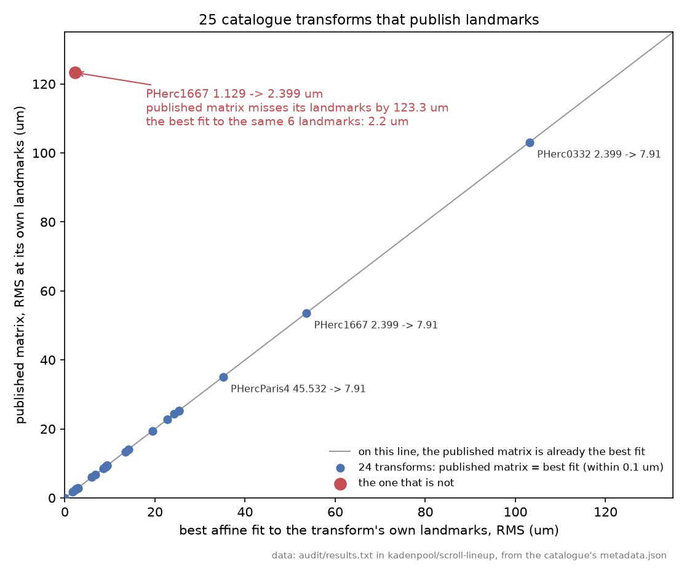

# Do the published transforms fit their own published landmarks?

Some official transforms in the challenge's `metadata.json` ship the landmark pairs they were built
from, as `from_landmarks` and `to_landmarks`. Applying the matrix to the from-points should land on
the to-points. This measures how far it actually lands, for every transform in the catalogue that
publishes landmarks.

```
python audit/audit_landmarks.py            # about 4 s, reads only the public metadata
python audit/audit_landmarks.py local.json # or point it at a local copy
```

It needs numpy and fsspec, both of which the tool already requires. It uses nothing else from this
repository, so it can be lifted out and run on its own.

## What it reports today

`results.txt` is the output of the run committed here. Of the 26 official transforms, **25 publish
landmarks and 4 of those miss their own by more than 30 um**:

| object | moving to fixed (um) | landmarks | RMS um | worst point um | best affine um |
|---|---|---|---|---|---|
| PHerc1667 | 1.129 to 2.399 | 6 | **123.3** | 212.5 | **2.2** |
| PHerc0332 | 2.399 to 7.91 | 6 | **103.1** | 133.9 | 103.1 |
| PHerc1667 | 2.399 to 7.91 | 12 | **53.6** | 117.8 | 53.6 |
| PHercParis4 | 45.532 to 7.91 | 8 | **35.1** | 63.4 | 35.1 |

The other 21 sit between 0.0 and 25.3 um, and fourteen are under 10. So the four are separated from
the rest by a clear gap rather than by where a threshold was drawn.

## A residual on its own does not say the matrix could be better

The last column is the reason the four are not one kind of problem. For each transform it fits the
best affine those same published landmarks allow, by least squares, and reports how far that fit
lands from them. **For 24 of the 25 the published matrix already is that fit**, to within 0.1 um. So for three of the four flagged, no affine can hit those landmarks, and no better matrix exists for them: either the landmarks are off or the two scans bend relative to each other, which one matrix cannot follow. The thing to look at is the landmarks and the scans, not the matrix.

One is different. `PHerc1667 1.129 to 2.399` misses its own six landmarks by 123.3 um where a
least-squares affine on the same six points misses by 2.2 um. That is a matrix that is not the fit
its own data gives. This tool's own answer for that pair, computed from the two volumes with no
landmark input, lands 6.3 um from those landmarks (`../robustness/r6_1667roi/`), which is the one
pair of the 26 where this tool beats the official matrix on landmarks.



*One dot per catalogue transform that publishes landmarks. Across: how close the best affine fit to
its own landmarks gets. Up: how close the published matrix gets. On the diagonal the published matrix
already is that fit; one transform sits far above it. Drawn by `plot_landmark_fit.py` from
`results.txt`.*

`reproduce_1667.py` re-derives that transform's numbers from the public bucket in about three minutes,
prints the least-squares matrix in the catalogue's own form, ready to replace the published one, and
works one patch of one surface through both (`--quick` for the matrix alone).

What that costs a surface carried through it is measured, with controls and a placebo, in
[ScrollPrize/villa#1843](https://github.com/ScrollPrize/villa/issues/1843): of the 19 published PHerc1667 meshes in the 1.129 um frame, the four measured sit off the papyrus, and moving them onto that fit moves them back toward it (on the two segments named before they were run, 27 of 46 patches, p = 0.031).

## Which copy: the challenge publishes two, and for one pair they disagree

A transform is published in two places: in the catalogue, `metadata.json`, and as a `transform.json`
inside the moving volume's own zarr folder. **The table above audits the catalogue copy.**
`compare_copies.py` checks the other one:

```
python audit/compare_copies.py            # about 20 s, one small fetch per volume
```

Its committed output is `copies.txt`. Of the 26 catalogue transforms, **18 also have a per-volume
copy; 17 are identical to the catalogue, and one is not.**

| PHercParis4, 45.532 to 7.91 um | landmarks | RMS um | median um |
|---|---|---|---|
| catalogue copy, `metadata.json` | 8 | 35.1 | 28.3 |
| per-volume copy, `transform.json` | 15 | **518.3** | **356.8** |

Different matrix, different landmarks. The per-volume copy was also tested the other way round,
target to source through its inverse, in case it is simply stored backwards: it still misses by
509.2 um RMS, so it is not. It names its target in an older style,
`PHerc4Paris-20230205180739_masked`, which suggests it predates the catalogue entry.

**Why this matters beyond one pair:** someone reading the per-volume file and someone reading the
catalogue get transforms about 15 times apart in fit (518.3 against 35.1 um RMS), with nothing to tell them which they have. It is
also why a published number can look like it contradicts this audit when it does not: Wadoekeani's
`vc-segqa` (13 Sep 2026) reports this pair at about 356 um, measured on the per-volume
`transform.json`, which is the same file and the same figure as the second row above.

## Prior work

- **villa #791** (jrudolph, March 2026), "registration: provide tools to review landmark matching
  errors", added per-landmark error reporting when a transform is fitted. The team can already see
  this for any transform it fits; what is new here is applying the check to every transform the
  catalogue publishes, and to both published copies.
- **Wadoekeani, `vc-segqa`**, measured two PHercParis4 transforms against their own landmarks in
  passing, as part of a cross-resolution segment check. Covered above.

## Why 30 um

The released ink models are documented as sensitive to depth offset, and flummoxjr published a
measurement on 17 August 2026 of how the response decays inside plus or minus 6 layers. (Layers of
the rendered surface, not voxels of the volume; on a 9.362 um scan one layer of that render is one
9.362 um step, which is the equivalence the budget rests on and the reason it is stated here rather
than assumed.) Six layers is about 56 um, so 30 um is a little over half of the window that public
measurement covers. Half would be 28; 30 is a round number near it and nothing turns on the
difference, since the four flagged sit at 35 and above while the next is 25.3.

It is a deliberately conservative line drawn from a public number, not a derived constant. **Which
rows appear obviously does depend on where it sits**: at 40 um the table has three rows, at 25 um it
has six. What does not depend on it is the gap, since the flagged four start at 35.1 and the next
value down is 25.3.

## What this is not

- **Not a claim the matrices are wrong for what they were fitted for.** A transform can be a good
  global fit and still miss individual clicked points, and landmark placement has its own error.
- **Not a claim this tool does better. It is mostly worse.** Measured the same way against official
  landmarks, this tool beats the official transform on **1 of the 25 pairs that publish them** and is
  worse on the other 24. The 26th publishes none. On PHerc0332 ours sits 104 um from the same six points
  the official matrix misses by 103. The one win is PHerc1667 1.129 to 2.399, at 6.3 um against
  123.3, and one pair is not a generalisation.
- **And the comparison is not like for like, in the reference's favour.** This table measures each
  official matrix against the points it was *fitted to*, which is an in-sample residual and the
  easiest test a fit can be given. This tool's errors are measured out of sample, on points it never
  saw. A fit that cannot hit its own fitted points is the finding here; it does not follow that
  anything else fits them better.

## One trap, since it cost us a wrong number

Take the voxel size from the volume's `long_id`, not from `data.origins`. A volume can carry several
origins and the last may be a prediction store whose path has no voxel size in it, which silently
yields `None`. A `None` scale then leaves the answer in voxels rather than microns, and voxels look
like a plausible number rather than an error. The first run of this script reported 51.4 instead of
123.3 for exactly that reason.
