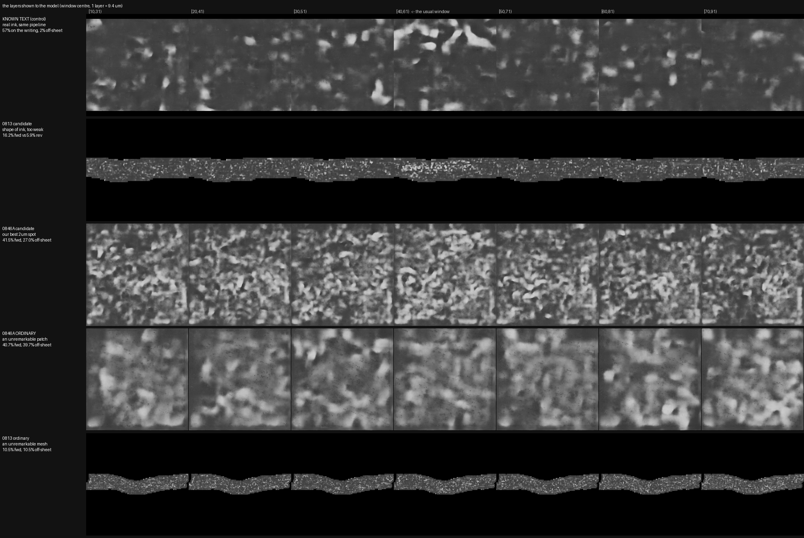

# Four controls for an ink negative, tested on three unread scrolls

**Four cheap checks tell a real ink reading from papyrus
texture.** Each compares what the released 9.362 um ink
model says about a candidate with what the same model,
through the same code, says about ordinary papyrus:

1. **An off-sheet null.** The same mesh shifted onto the
   neighbouring wrap and run again. One extra inference.
2. **A within-scroll null.** The scroll's own ordinary
   surfaces, scored through the identical pipeline.
3. **A negative-only adaptation.** The released model
   retrained with ordinary papyrus labelled "no ink", its
   pass rule fixed first.
4. **A depth sweep calibrated on known text, with its null
   swept the same way**, so that looking at many depths
   cannot manufacture a winner.

Real text through the same code answers 18.9 % on the
sheet, 0.8 to 2.4 % off it, forward only, in rows. On
PHerc0846A, PHerc0813 and PHerc0211 the model calls 10 to
24 % of the sheet "ink" at the median and up to 48 % in
places, calls almost as much of the papyrus one wrap away
"ink" too, and answers about as strongly with the depth
order reversed. **We found no letters on any of the
three.**

The scale: about 256 cm2 of pscamillo's published meshes
on two scrolls, 60 grown surfaces on the third, a
known-text control in every batch, and an independent
seating check that caught one of our own overclaims.
Everything ran on the challenge's published volumes, with
the challenge's published models and inference code, at
the resolution the eligibility rules require. Nothing was
trained on any unread scroll's ink, because no such labels
exist.

---

## What this is not, and who showed why it matters

**This is not a claim that these three scrolls have no
ink.** It is a measurement of what the released models
answer on these surfaces, at these depths, under these
controls. The distinction is not ours and it is not
hypothetical: FrankTheRope published it in September 2026,
with the control that makes it stick. Running `ink_9um` on
PHerc1667, where the text is known, it reaches pixel AUC
0.886 against the official labels and still, in their
words, "draws blobs where the letters are, not glyphs".
The same slices in reversed depth order fall to 0.689.
Their conclusion is the one we adopt: **"the
eligible-scroll negatives cannot be read as 'there is no
ink'."** A model that cannot draw a letter where a letter
demonstrably is cannot be trusted to prove one absent.

**Jinhojeong established the deeper version of the same
problem** in July 2026, on the 2023 grand-prize TimeSformer
rather than these 9 um models: across 71 segments, no
automated letterness score they tried ranks the Scroll 1
positive control near the top, "which means there is no
working positive control for letterness on the unreadable
scrolls." Jinhojeong measured and rejected entropy-minimisation
test-time adaptation on those grounds, and declined to run
CycleGAN as a letter finder at all, because its output
would be unverifiable. Our first rescue, in section 4, is
the negative-only adaptation they did not test, and it fails
for a reason they would recognise.

**TAUIL-Abd-Elilah supplied the cautionary case.** Their own
PHerc1447 ink negative was published and then withdrawn
within two weeks, not because the ink work was wrong but
because they measured the surfaces underneath it and found a
median 61.2 degrees against the local sheet, 0 of 14
within 30, where a random orientation averages 60. In their
words: the negative "shows no ink was recovered from these
surfaces, not that PHerc1447 lacks ink in those regions."
Section 9 is written so that this report cannot fail the
same way silently.

**Others have surveyed these scrolls too, and on two of
them with more surface than we used.**

- **TAUIL-Abd-Elilah's `corpus-ink-survey`** (from 14 Sep
  2026) scores 324 meshes across all eight eligible
  scrolls, 82 of them on PHerc0211 and 71 on PHerc0813,
  with `ink_9um` and the team's `hecate` model against a
  known-ink control. No letters. It names two candidate
  locations, and section 5 reads both through our numbers.
- **rodriguescarson's `eligible-scroll-atlas`** (15 and 16
  Sep 2026) has rendered all 340 published meshes on those
  eight scrolls into the team's layout, under a
  pre-registered screen whose four variants pass 5, 2, 0
  and 1 of them (none passes all four; checked 26 Sep 2026).
- **gmDevi's `vc-windows-tools`** holds a PHerc0846A batch,
  added on 11 Sep 2026, that scores 12 windings with the 9
  um model for letter-like blobs and finds a single one,
  on one of them. gmDevi's write-up does not discuss it.
- The PHerc0813 and PHerc0211 meshes are **pscamillo's**,
  from `vesuvius-eligible-meshes`, the corpus both surveys
  above also start from.

**What is ours**, after checking: the four controls as one
set, and an independent reading of the two places TAUIL's
survey names. Not the scrolls themselves. Of the four, the
negative-only adaptation and the depth sweep with a swept
null appear nowhere else we looked. TAUIL's survey compares
candidates against blank meshes and bins pixels by how
well the sheet is centred, which are close relatives of
our first two.

---

## 1. Seven runs, the rule fixed before each, and the verdict

| run | scale | verdict |
|---|---|---|
| 2.4 um survey, 0846A | 60 surfaces | no rows |
| 9 um check, 0846A | 6 regions | can't tell, then ordinary |
| whole-scroll re-read, 0846A | 115 windows | ordinary |
| adaptation, 0846A | 2 training runs | fail, G3 |
| survey, PHerc0813 | 32 meshes | nothing stands up |
| survey, PHerc0211 | 30 meshes | nothing stands up |
| depth sweep, all three | 28 windows | fail, 0 of 28 |

**2.4 um survey, PHerc0846A.** 60 grown surfaces, 170
window-direction readings. *Rule:* not pre-registered. A
text-likeness scorer ranked windows and a person looked at
the top of the list. *Verdict:* no rows at any window. The
strongest of the second pass are single clouds, at 51.1 %,
46.8 % and 44.3 %. That scorer separates known text from
shuffled blobs only at AUC 0.60 at this window size, so
its ranking is a shortlist and never a verdict.

**9 um check, PHerc0846A.** Six candidate regions on the
eligible 9.362 um volume, with off-sheet nulls. *Rule:* a
candidate stands out if its 9 um / 2 um overlap beats the
within-scroll null's 95th percentile on **both**
checkpoints. *Verdict:* the file's own first answer was
"can't tell". Run against the null, the overlap turns out
to be common to ordinary 0846A papyrus. One of the two
leading candidates is ordinary; the other clears the bar
on one checkpoint only, so by the rule it is not a robust
outlier.

**Whole-scroll re-read, PHerc0846A.** All 115 windows,
both checkpoints. *Rule:* none. This run measured the
scroll's own spread. *Verdict:* median 24.0 % on-sheet,
90th percentile 34.5 %, range 9.1 to 44.6 %.

**Adaptation, PHerc0846A.** The released model retrained
with ordinary papyrus labelled "no ink". *Rule:* G1,
known-text AUC at least 0.83. G2, off-sheet share after
divided by before under 1/3. G3, at least one candidate at
2 % or more on-sheet with on/off above 3. *Verdict:* G1
pass at 0.876, G2 pass, **G3 fail**. Closed by its own
pre-registration.

**Survey, PHerc0813.** 32 of pscamillo's 75 meshes, 128.8
cm2 rendered of 131.8 selected, two checkpoints, both depth
orders. *Rule:* the control must read known text at 0.85
or better, and a mesh must stand above the scroll's own
on/off spread on both checkpoints and both orders.
*Verdict:* control 0.877. Median 11.0 % on-sheet against
9.4 % off. No mesh met the rule. Two were kept for a
by-eye look at 1.96x and 1.85x their own null, where the
control gives 8 to 24x.

**Survey, PHerc0211.** 30 of pscamillo's 90 meshes, 127.2 cm2
rendered of 131.1 selected, same pipeline. *Rule:* the
same rule. *Verdict:* control 0.877. Median 10.1 %
on-sheet against 10.1 % off. Nothing qualified even for a
look.

**Depth sweep, all three.** 28 windows, 17 positions
through the whole 0.95 mm render, both orders. *Rule:* the
sweep must separate right depth from wrong on known text
before any scroll window is judged, and a hit must beat a
null swept the same 17 times. *Verdict:* on known text the
reading collapses from 0.877 to near chance one step away,
so the sweep works. On the scrolls, **0 of 28** pass, best
on/off 2.41 against a bar of 3.

## 2. The control

Every batch carried the same control: PHerc0139 segment
w016, the official 9.362 um mesh, rendered with the same
recipe and scored against the challenge's own published
ink labels.

| | on the sheet | off the sheet | on/off |
|---|---|---|---|
| known text, w016 | 18.9 % | 0.8 to 2.4 % | **8 to 24x** |
| PHerc0846A, 6 candidate regions | 15 to 48 % | 7 to 36 % | about 1x |
| PHerc0846A, all 115 windows | median 24.0 %, p90 34.5 % | | |
| PHerc0813, 32 meshes | median 11.0 % | 9.4 % | 1.15x |
| PHerc0211, 30 meshes | median 10.1 % | 10.1 % | 1.00x |

The control reads AUC **0.877** forward and **0.525**
reversed, in every batch, to the same three decimals. It
calls 57.2 % of labelled ink pixels "ink" and 7.4 % of
labelled background. On the scrolls the depth order barely
matters: 15 of the 28 swept windows answer more strongly
backwards.

That is what makes the negative readable. When a scroll
answers 11 % on the sheet and 9 % off it, the comparison
is not against an idea of what ink looks like. It is
against the same model reading real ink through the same
code an hour earlier.

## 3. The picture

Each row is one surface. Each column is a different
21-layer window cut from the same 101-layer render, so the
only thing that changes along a row is which 0.2 mm the
model was shown. The control row is real ink. The rest are
the best candidates we had and ordinary patches from the
same scrolls, and they do not change much.

## 4. The two rescues, and what happened to them

### "The model over-fires on this scroll's texture. Teach it the texture."

We continued training the released model on its own
published labelled text, plus windows of ordinary
PHerc0846A papyrus labelled "no ink", with the pass rule
fixed first.

- Off-sheet firing went to about zero. **G2 pass.**
- Known-text reading held at AUC 0.876. **G1 pass.**
- Every candidate region fell to between 0 and 1.8 %
  on-sheet, while an ordinary held-out window of the same
  scroll reached 2.2 %. **G3 fail.**

The texture is something the model can unlearn. Underneath
it there was nothing that stood out. A negative-only
adaptation can also learn to ignore faint real ink, so
this is a failure to find, not a proof of absence.

### "You are reading the wrong 0.2 mm."

Every run above fed the model a 21-layer window at the
nominal sheet centre out of a 101-layer render. If the
meshes sit off the sheet's mid-plane, the ink layer is
elsewhere.

We measured that on known text first. The model reads the
writing at the sheet centre and drops to near chance one
10-layer step away (94 um): 0.877 at the centre, 0.571 at
minus 10, 0.537 at plus 10. So a sweep can tell right
depth from wrong.

Then we swept 17 positions on 28 windows of the three
scrolls, and swept their nulls the same 17 times, so that
looking often could not manufacture a winner. 476 readings
per direction.

- **0 of 28 passed.** Best on/off ratio anywhere: 2.41,
  against a bar of 3.
- On PHerc0846A the six candidates land between **0.69 and
  1.18** times the strongest ordinary window of that scroll.
  Four of the six sit below it.
- Only **10 of 28** windows peak at the conventional centre.
  With a flat response the best depth is noise, and that is
  what it looks like.

The clearest way to put it is one ratio. Take each
window's weakest depth divided by its strongest:

| | weakest / strongest |
|---|---|
| known text | **0.06** |
| the 28 scroll windows | median **0.59**, range 0.29 to 0.85 |

Real ink is a layer: move off it and the answer collapses
to a sixteenth. The scroll windows answer within about a
factor of two no matter which 0.2 mm they are shown. That
is a property of the material, not of a plane inside it.

**The one thing that survived.** Two of the 28 windows
pass the shape gate, an answer that falls by half or more
20 layers either side, which is the shape real ink has:
z13088_w040 on PHerc0813, forward (16.2 % against 5.9 %
reverse), and z9120_w020 on PHerc0211, in reverse (14.8 %
against 11.0 % forward). Both fail on size. Neither
reaches 3x its own swept off-sheet null (2.15x and 1.74x),
and against the strongest ordinary window of its own
scroll they sit at 1.54x and 1.00x. z9120_w020 also
answers in reverse, which the pre-registration does not
count as a hit. Both are a fail and are reported as one.
They are also the two places that another survey,
published the next day, names as candidates: section 5.

## 5. TAUIL-Abd-Elilah's two candidate locations, through our numbers

TAUIL's survey names two places as **candidate locations,
not discoveries**: a region of PHerc0813 at `z12496_w060`,
read forward, on the face that carries text on their
control; and a tall stretch of PHerc0211's inner wrap from
`z6112_w020` to `z9120_w020`, read in reverse. Our
surveys scored meshes in both places with a different
render, a different scoring rule and different nulls, on
checkpoints of the same model.

| TAUIL's location | our reading, both checkpoints | x own off-sheet null | depth sweep |
|---|---|---|---|
| PHerc0813 `z12496_w060`, forward | forward, 13.8 % against 7.8 % and 27.2 % against 19.1 % | 1.23x, 1.35x | not swept |
| `z13088_w040`, which TAUIL's survey ranks second and calls the candidate's neighbour | forward, 16.3 % against 6.0 % and 29.9 % against 16.0 % | 1.85x, 1.68x | passes the shape gate, forward |
| PHerc0211 inner wrap, `w020`, reverse | all 4 of the stretch's meshes that we scored lean reverse on both | 1.35x to 1.90x | `z9120_w020` passes the shape gate, in reverse |

**The places agree, and so do the directions.** Only two
of our 28 swept windows passed the shape gate, and they
are `z13088_w040` beside TAUIL's PHerc0813 candidate, forward,
and `z9120_w020` at the end of TAUIL's PHerc0211 stretch, in
reverse. Neither survey took those places from the other:
our windows were fixed and scored on 13 Sep, and TAUIL's
survey was first published on 14 Sep.

**The strength is not there.** Real text through the same code
gives 8 to 24x its own off-sheet null. None of the meshes
in the table reaches 2x on either checkpoint, and both
shape-gate windows fail the pre-registered bar of 3.

So we put it as TAUIL does. These are the places on these two
scrolls that look most like ink to both surveys, theirs by
strength and ours by the shape of the depth response, and
they are candidate locations, not discoveries. Ink, stain, glue or a surface artefact all
remain consistent with what both surveys see. A reverse
reading is weaker evidence than a forward one of the same
size, because on the control the text face reads forward.
TAUIL's `z7312_w020` was not in our selection, so we have no
reading for it.

## 6. What this is worth to someone else

**1. A depth-response curve for the released 9 um model.**
flummoxjr measured the inside of the curve on 17 Aug 2026,
at 1-voxel steps from minus 6 to plus 5, which is as far
as a 28-slice published render reaches.
tarikcankorkmaz00 has since shown that the best window
moves from tile to tile, with 31.2 % of the tiles in their
main result putting it on the edge of the plus or minus
47.98 um the released volumes contain. Ours measures the
outside for one region, on a 101-layer render: fine within
about 6 layers, gone by 10. The model card says the models
"can be quite sensitive" to a z offset and offers
`--layer-start` / `--layer-end`; this is part of the map
for those flags. Written up separately, on public data.

**2. A within-scroll null that is cheap and hard to
fool.** Score a scroll's own ordinary surfaces through the
identical pipeline and compare a candidate against those,
rather than against a threshold or against another scroll.
On all three scrolls this is what turned an exciting
number into an ordinary one. Our own first 0846A report
had to be corrected by exactly this test.

**3. An off-sheet null costs one extra inference.** Render
the same mesh shifted 40 voxels (0.37 mm) and run it
again. At the sheet spacing on these scrolls, 150 to 250
um, that lands on a neighbouring wrap rather than on air,
so it is a fair "ordinary papyrus at a random depth"
comparison. Real ink gives 8 to 24x. Texture gives about
1x.

**4. Negative evidence on three scrolls under those
controls**, with the surfaces, the code and the numbers.
Read it beside TAUIL's and rodriguescarson's larger surveys
of two of them, not instead of them.

**5. A caution about seating scores at coarse
resolution.** axiosdevs' seating test has the right idea
and careful validation of its own, but every number in
both its published calibrations was measured on 1.1 to 2.4
um scans. At 9.362 um the smallest half-gap its walk can
return is 150 um, against a sheet spacing of 150 to 250
um, and on our control it chose 374.5 um. We measured both
failure directions on our own data: the highest score we
saw anywhere, 34.88, sits 131 um off the sheet with a
contrast at the mesh of minus 4.59, while a mesh scoring
2.76 is seated to within 19 um. Anyone using it at 9 um
should measure the depth-profile offset instead. The 9.362
um known-good band we derived is 11.19 to 13.98, median
12.18, from five natively-seated official segments, all of
them PHerc0139, which is the only scroll that has one.

## 7. Cost

| run | GPU |
|---|---|
| adaptation, head-only | 1 h 30 m, one T4 |
| adaptation, full fine-tune | 2 h 12 m, two T4 |
| PHerc0813 survey | about 4 h, one T4 pair |
| PHerc0211 survey | 1 h 56 m, two T4 |
| PHerc0846A whole-scroll re-read | 2 h 29 m, two T4 |
| depth sweep | about 3 h, one 2xT4 session |
| **total** | **about 15 h of session time** |

Roughly a third of the depth sweep's GPU time was wasted
on a run that filled its own disk. Renders ran for a few
days on one 8-core CPU box. No money was spent: free tiers
and boxes already to hand.

## 8. Fixes that came out of the work

As of 26 Sep 2026:

**Merged.**
- #1731: published surfaces were being returned for
  height ranges their points never reach. The 28
  affected surfaces are bkalita-git's finding in #1618;
  this fixes the filter that let them through.
- #1665: the Python library demanded AWS credentials for
  a public bucket, then reported the failure as "the
  array does not exist". Bullo27 reproduced it with no
  credentials on their own machine.
- #1676: a dataset read past the end of its own data.
  Caught by a sanitizer, not by published scroll data.
- #1682: creating a pyramid level failed under zarr 3.

**Open.**
- #1847: a failed chunk download killed a tool with a
  crash dump instead of an error. Bullo27 confirmed the
  fix on Linux with GCC before I opened it.
- #1717: a render that falls outside its volume now says
  so. Its survey was re-run on 26 Sep (252 of 898
  surfaces with more than 0.1 % of their points
  outside), and it is ready for review.
- #1766: the layer window. flummoxjr published the same
  window first, on 3 Sep, and is credited.

**Open, and waiting on me rather than on anyone else.**
- #1769: VC3D trusting a bad stored bounding box. In
  draft until the on-screen check is done.

**Issues, no patch attached.**
- #1765 (the window, behind #1766), #1730 and #1734 (two
  metadata faults; SurgeFok built a checker that
  validates against #1730), #1835 and #1843 (published
  transforms that miss their own landmarks; correcting
  #1843's moves the meshes onto denser papyrus), #1845 (which mesh you
  render a segment from), #1846 (the crash behind #1847).

## 9. Honest limits

**Three scrolls, one model family, one rendering
pipeline.** A different model, or a scan campaign with
different reconstruction, could answer differently.

**Seating.** If a surface drifts between sheets it feeds
the model a mixture at every depth, which would look like
the flat response we report. We tested that with a
published community tool and with a direct depth-profile
offset measured on the very layer stacks the model
consumes.

- Of the 15 of our meshes profiled directly, **9 sit within
  6 layers (56 um) of a sheet centre and 6 are off by 131 to
  328 um.** We do not claim good seating as a population.
- **Independently, and not by us**, TAUIL-Abd-Elilah
  measured the corpus our PHerc0813 and PHerc0211 surfaces
  are drawn from, 338 of its 340 meshes, against the sheet
  normal taken from the local structure tensor of the raw
  CT. Note the instrument: that is raw CT, not the team's
  surface prediction, which TAUIL uses only as a separate
  second gate elsewhere. TAUIL reports **PHerc0211 at a median
  7.8 degrees with 85 of 88 within 30, and PHerc0813 at 9.0
  degrees with 71 of 75**, against a 60 degree
  random-orientation null. So the failure mode that forced
  their own PHerc1447 withdrawal demonstrably does not apply
  to two of our three scrolls.
- **PHerc0846A is not in that corpus at all**, so it has no
  equivalent clearance and we do not claim one. It is also
  the scroll with the worst published phantom fraction in
  the m7 surface predictions, 58.2 % at voxel level against
  a 42.1 % average, so of the three it carries the most
  geometric risk and the least independent reassurance.
  Read the 0846A result with that in mind.
- Carry TAUIL's caveat with TAUIL's numbers: **a low, tight reading
  is evidence; a high, scattered one is not evidence of
  anything.**
- The argument therefore runs on the subset that is provably
  seated. Six of the swept windows are within 56 um, and
  their median answer is **1.20x** their own scroll's null,
  where real text gives 8 to 24x.
- Across the 28 swept windows, the seating score and the
  forward ink share are uncorrelated (rho **minus 0.01**).
  Measured against the ratio to the scroll's own null
  instead, it is **plus 0.30**: on that column the
  better-seated windows answer slightly more. Neither sign
  rescues a reading.
- The single cleanest case is in the PHerc0813 survey:
  z7696_w020, centred on its sheet to within one layer,
  answers **1.98x** its own off-sheet null, in the reversed
  depth order.
- The two seating instruments agree only at rho **plus 0.35
  to plus 0.51** across 26 windows, so neither is quoted per
  item without the other.

**And the counterweight, which is newer than any of the
above.** On 14 September 2026 axiosdevs published that
sheet contrast is **anti-correlated with ink readability**,
r = minus 0.900 across 20 depth-window settings scored
against the published PHerc0139 ink map: leaving the
geometry alone gives contrast +11.17 at r +0.877, while
maximising sheet contrast gives +36.18 at r +0.594. Their
line is the one to answer: "a silent detector over such a
surface is **not explained by its looseness**." That is a
different quantity from the obliquity above: a
micron-scale wobble along the normal, not a shear across
the windings. So it does not refute the seating argument. But it does
mean **we do not offer poor seating as the explanation for
a null**, and nothing in this report rests on that move.

**An earlier version of this claim was wrong, and we
corrected it.** A 12 Sep check concluded that the
PHerc0846A surfaces "are on a papyrus sheet, not in the
gaps". It measured whether a bright band exists near the
mesh, not whether the mesh sits on it. The seating work on
14 Sep retracted that headline. What survived, now
confirmed by two further instruments, is the other half:
over-firing tracks good mesh position rather than bad, at
Spearman **plus 0.57** over 27 windows, so the response is
not an artefact of bad surfaces.

**All of it is negative evidence.** None of it says these
scrolls hold no writing. It says these tools, used this
way, cannot show it.

If someone picks this up, I'd want them to put a different
model through these same four checks on these three
scrolls, because one model and one pipeline is as far as
this report goes.

## 10. Where the numbers come from

The headline figures above, 125 of them, are re-derived
from committed files by `trace_numbers.py` in this folder. It reads the depth
sweep's `results.json` and the control curve, recomputes
the headline ratios, and exits non-zero if the document
and the data disagree.

`NUMBERS.md` lists the headline numbers, the file each
comes from, and the pre-registration that fixed the rule
before the number existed. `depth_sweep_table.md` is the full
28-window table with all three gates.

---

*Disclosure.* This analysis, its code and this write-up
were produced with Claude Code, directed by the author.
The pre-registrations, the controls and the verdicts ship
in `data/`, and `NUMBERS.md` says which rule was written
down before which number existed. The times behind that
come from our working repository's history, which is not
public, so they are our record rather than proof anyone
can check independently.

*Edited 26 Sep 2026: a leftover draft banner is removed, and the atlas's finished screen
and #1843's corrected wording are brought up to date.*

*Edited again 26 Sep 2026, wording only: the researchers this report and its CITATIONS.md cite are
named or called "they", where the text had assumed "he".*
