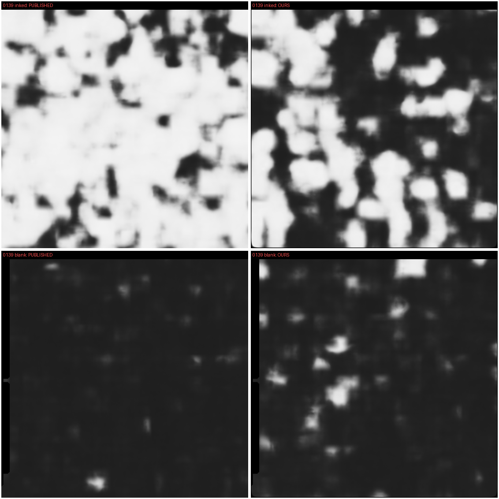
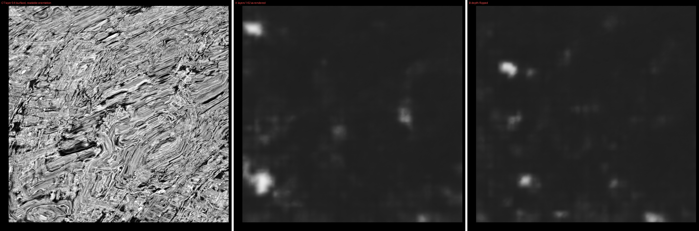
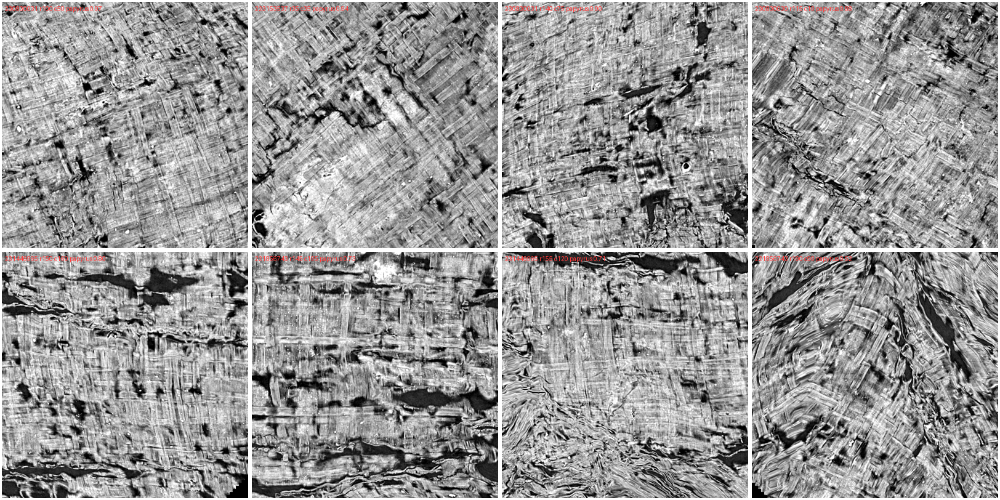
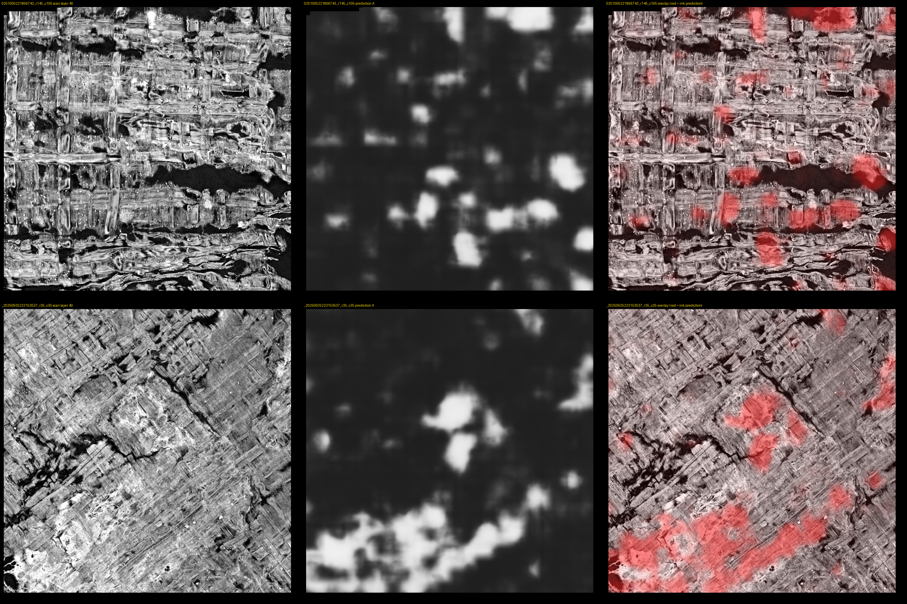
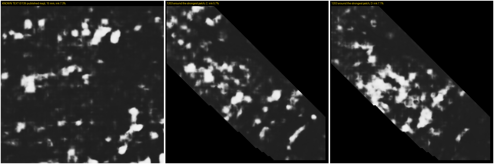
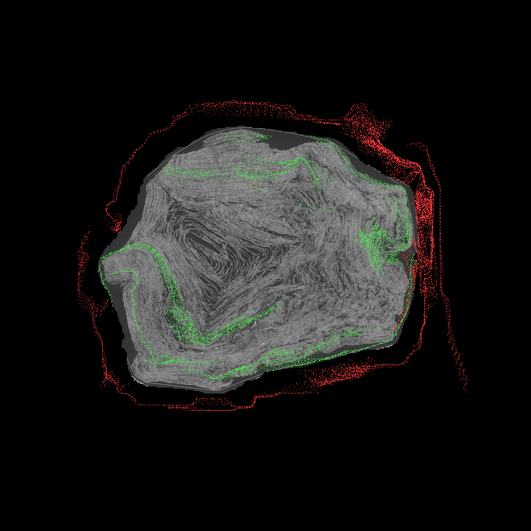
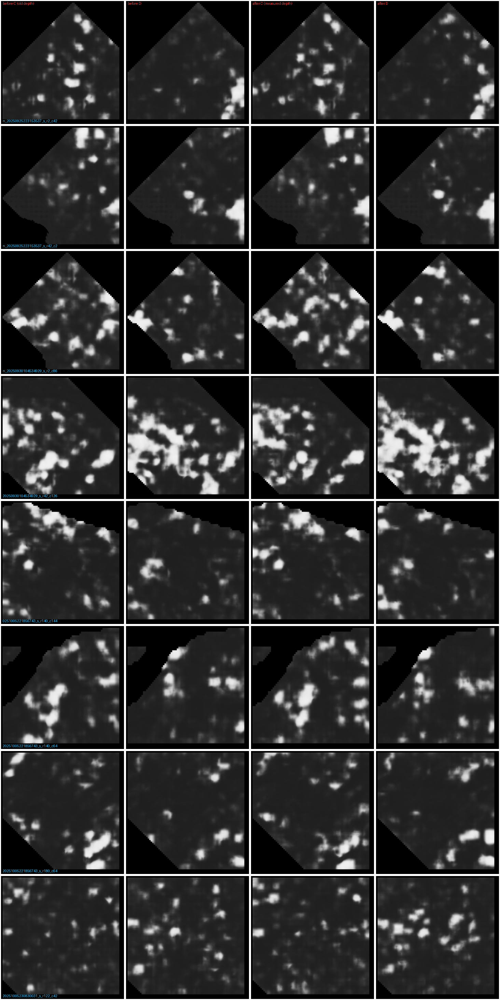
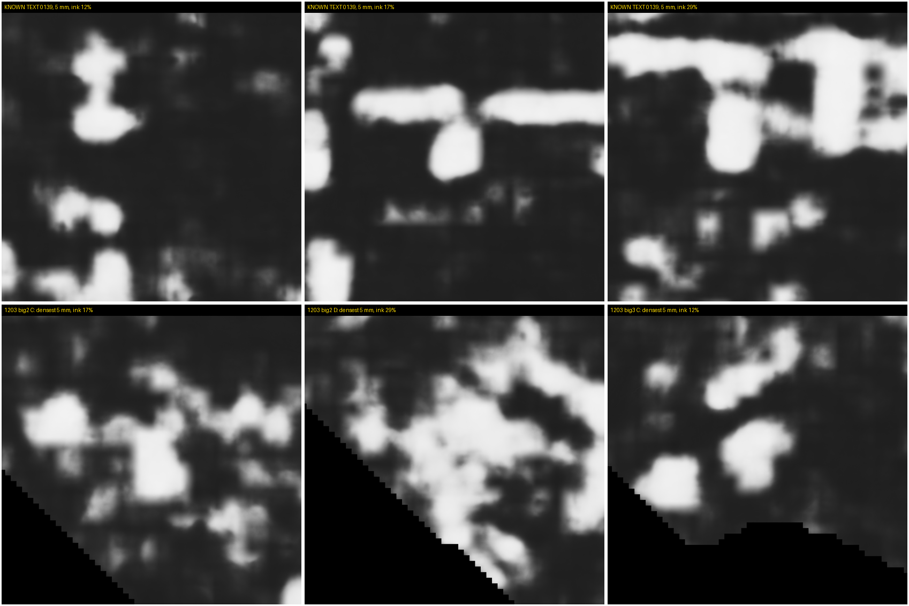
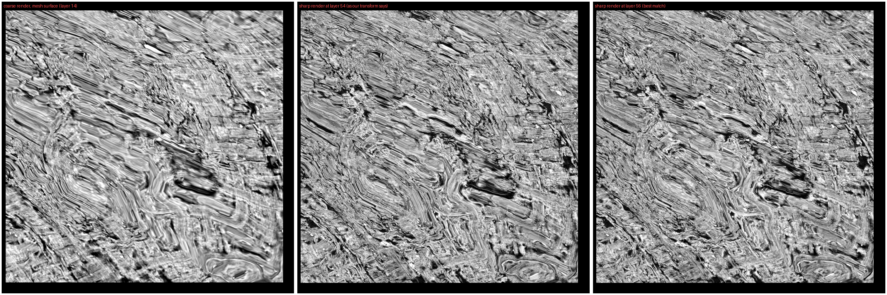

# First Letters workflow report: PHerc. 1203

Written 12 and 13 Sep 2026; its numbers re-checked by its own tracer on 21 Sep 2026. Every number names the file it came from, and those files are in `data/`, copied read-only from the two CPU boxes the work ran on: box A for renders and box B for registration. The figures and notes the text cites are under `data/evidence_0911/`, `data/evidence_0912/`, `data/evidence_0914/` and `data/scratch_canon/`. The scripts it cites are under `data/` at the paths given, except `look_big2.py`, which stayed on box A, and `scanreg.py`, which is this repository's `scroll_lineup.py` under its earlier name; `compare1203.py` is at this repository's root. Paths under `submissions/` name our working notes, which are not published.

## 0. In one paragraph

We tried to read PHerc. 1203 by a route the rules allow: surfaces grown on the official 9.362 um
scan, rendered from the scroll's sharper 2.403 um scan through a validated scan-to-scan transform,
and read with the challenge's own 2 um ink model. The model and runner reproduce the challenge's
published ink maps on PHerc. 0139 (12 windows: text match r 0.82 to 0.92, blank windows at 0.2 to
1.2 % ink) once the model's layer window is centred on the sheet, which the tool's README did not
say (now villa issue #1765). On PHerc. 1203
we scored 127 windows of 7.5 x 7.5 mm: 35 on 8 of the 22 public segments and 92 on 34 of the 60
surfaces we grew in the band the public segments do not reach, plus five 15 mm regions. A few
windows respond as strongly as known text by ink share (best 28.0 % of covered pixels in one depth
order, on a public segment after the corrected registration; 28.1 % by the before/after script's
measure, section 5.6; best 21.7 % in the new band), most respond at or near the blank level (median
2.5 % on the public segments, taking each window's better depth order; in the new band 3.8 % over
all 184 window-orders and 5.2 % over the 92 windows' better order).

At letter scale the strong spots do not look like writing,
and in a blind check Kaden marked "writing" on 2 of 6 PHerc. 1203 crops against 9 of 16 crops of
real text. **No letters were found.** The verdict sentence in section 6 is Kaden's, written after
the checks.

I went after PHerc1203 because the fine scan is where you can actually see something, but it had
no published transform to the 9.362 um scan the First Letters rules accept, so nothing I found on
the fine scan could count until I could place it myself.

---

## 1. What we tried to do

**The prize.** $50,000 per scroll for "10 letters within a single 4 cm² area" of an eligible scroll
(scrollprize.org/prizes, First Letters). PHerc. 1203 is on the eligible list with one volume,
`20250820131727` at 9.362 um (`prizeEligibility.json` as read on 10 Sep).

**The rule that shaped the route.** PHerc. 1203 also has a 2.403 um scan (`20260319130212`) over
part of its length. On 8 Sep a maintainer answered, in villa issue #1739, that "Evidence submitted
for the First Letters prize must be derived entirely from an eligible volume", that for PHerc. 1203
this means the 9.362 um scan only, and that "It is ok to e.g. train a model on some 2um data (even
from the same scroll), provided you then apply it on 9um for your submission"
(https://github.com/ScrollPrize/villa/issues/1739, comment by pmh47, 8 Sep 2026).

So the 2.403 um scan cannot be the evidence. It can be the scout. Our plan, in order:

1. Grow surfaces on the official 9.362 um volume, inside the length the 2.403 um scan covers.
2. Register the two scans, so a surface from the 9.362 um volume can be rendered from the 2.403 um
   volume.
3. Run the challenge's 2 um ink model (`scrollprize/ink_canonical_2um`) on those renders and look
   for anything letter-like.
4. Only if something letter-like turned up: go back to the 9.362 um volume for the evidence, with a
   model applied there, as the rule requires.

We got through step 3. Step 4 was never reached, because nothing in step 3 earned it.

**Prior public work on this scroll, which we build on.** PHerc. 1203 has had at least four public
attempts, all negative, and its two scans had been registered twice before us:

- FrankTheRope, ScrollScout (https://github.com/FrankTheRope/scrollscout): a CPU ranking of 4 cm²
  windows of ink predictions by text-like structure; ran the 9 um model on the public PHerc. 1203
  segments and found forward and reverse predictions indistinguishable, with fibre false positives.
- flummoxjr, Measure Before You Hunt (https://github.com/flummoxjr/measure-before-you-hunt): a
  scan-quality index and a sheet-separability measure over the eligible scrolls; a corpus screen
  that found no text; for PHerc. 1203 only 1.36 cm² of in-band surface with enough contrast. Two things in that repo matter directly here: it pre-registered, on
  8 Sep, the same idea as our route (the 2 um model on 2.4 um renders of PHerc. 1203), with no
  result yet at the time we checked; and its `bench/w059_c0/RESULTS.md`
  (3 Sep) reproduced a published 2 um map exactly with layers [23,85), the setting our issue #1765
  now credits.
- robertlangdonn, PHerc1203 Readability Atlas
  (https://github.com/robertlangdonn/pherc1203-readability-atlas): a CPU geometry diagnostic that
  found the scroll mostly packed too tight to read, with rare readable pockets, and that all 22 public
  `auto_grown` surfaces sit in packed zones (its README).
- 7jycwjmbfn-eng, PHerc0139 physical audit
  (https://github.com/7jycwjmbfn-eng/pherc0139-physical-audit): registered the 2.403 um scan of
  PHerc. 1203 to the 9.362 um scan (held-out error 2.4 um median, its README) and shipped physical
  sheet labels; reports 7-14 % of tissue windows unmeasurable (its README).
- Two smaller debts. The fact that the challenge's `metadata.json` lists none of the 22 public
  PHerc. 1203 segments (they exist under `segments/raw/` on S3) was already in flummoxjr's
  `runpod/segment_catalog.json` (19 Aug) before we found it (submissions/DUPLICATE_CHECK_0912.md:19).
  Surfaces growing outside the scroll on the published surface prediction, which bit us in
  section 5.5, was already filed as villa issue #1254; meshes that cut across
  sheets on this scroll's 2.4 um prediction is villa issue #1675.

**What is new in ours** (stated so the overlap is clear, not to inflate it):

- The 2.4 um route carried through end to end on PHerc. 1203: windows on 8 of the 22 public
  segments in the overlap band, plus 60 new surfaces grown in the unsegmented band (34 of them gave
  usable on-scroll windows, 92 windows in all), rendered from the 2.403 um scan through a validated
  transform and scored with the 2 um
  canonical model at a window centred on the measured sheet position in each window (section 3).
- A blind, one-command scan-to-scan registration tool, validated on the 15 scan pairs for which the
  challenge publishes a transform; it showed our own first PHerc. 1203 fit was about 29 um off in
  height, which we corrected and re-ran (section 4).
- The layer-window finding (villa issue #1765, draft PR #1766) and its measured cost on 12 windows
  of a read scroll, found while calibrating this chain (section 4).
- The survey numbers themselves: 127 windows and five 15 mm regions, each depth order reported
  separately, with a blind human check against known text (section 5).
- The fixes merged or opened along the way (section 8).

---

## 2. Rules we used, and what we would pre-register next time

We did not pre-register the ink readout before looking at PHerc. 1203. The rules below were fixed
as the work went, and several changed after we saw results. We say which.

### 2.1 What was fixed before the relevant result

- **The model and its output.** The published 2 um checkpoint, run through a re-implementation of
  the official `optimized_inference` code that is bit-identical to it on CPU (0 of 13,440 pixels
  differ in the end-to-end test; data/scratch_canon/README.md:106-109). The readout is the official uint8
  map; "ink share" means the fraction of covered pixels with prediction above 0.5
  (data/scripts_0911/make_survey_nb_1203g.py, summary line).
- **Both depth orders, reported separately.** Every window is scored twice, C = layers in the order
  rendered and D = the same layers reversed, and both numbers are reported (data/scripts_0911/survey_pipeline_1203g.sh). No rule required agreement between them. Ranking uses the
  larger of the two (data/scripts_0911/top_1203_survey.py:5-8).
- **Window selection.** Windows are 40 x 40 mesh cells (7.5 x 7.5 mm), chosen by papyrus texture in
  a native 9.362 um render, not by any ink result: crossed-fibre coherence, data coverage above 0.9
  and at most 2 windows per segment for the first set of 8 (data/scripts_0911/sel1203.py:11-43); at
  least 75 % coverage and 3 windows per surface for the new-band survey
  (data/scripts_0911/survey_sel_1203g.py:18-38).
- **The registration acceptance rule** for the scan-alignment tool was written before any pair was
  run: 95th-percentile error at most 30 um is PASS, at most 150 um is WEAK, worse is FAIL
  (submissions/registration_tool/PREREG_0912.md:23-25).
- **Three smaller gates set before their runs:** the corrected-transform rerun would only proceed
  if a hand-test window showed a sheet offset within 4 layers and a match above 0.3
  (data/scripts_0911/chain_1203_rr2.sh:7); a grown surface counts as off the scroll when under half its
  points fall inside the stored volume (data/scripts_0911/onscroll_1203g.py:40); the 12 control windows
  on PHerc. 0139 were picked by published ink share (text 10 to 60 %, blank under 0.5 %) with a fixed
  random seed before any of them was scored (data/scripts_0911/fliptest/driver.py:11, 21-27).
- **The blind check.** The answer key was sealed in a file before Kaden answered
  (data/evidence_0911/blind_key_DO_NOT_OPEN_until_answered.json and blind_key2_...json); the crops were
  the densest fully covered 5 mm crops of our strongest windows, mixed with crops of known text at
  the same scale.

### 2.2 What was set or changed after seeing results

- **The layer window.** The first 1203 runs used the README's documented window (layers 1-62) and a
  depth-flipped variant. A control on PHerc. 0139 then showed the documented
  window does not reproduce the published maps and a window centred on the sheet does
  (section 4). Every earlier 1203 number was declared uninformative and everything was re-run. Later still, the window was re-centred per window on the measured sheet
  depth (section 3.4). We now also know the exact centred window for an unshifted 109-layer volume
  is [23,85), not the [24,86) our pipelines use; on 8 known-text windows [23,85) matches the
  published maps slightly better (median r 0.905 vs 0.874). The 1203 runs
  were not repeated with that one-layer change.
- **What counts as "ink-level".** We had no threshold on ink share in advance. The yardsticks came
  from the PHerc. 0139 control after the fact: blank papyrus 0.1 %, dense text 85 % under the
  centred window, and the range of published text windows, 9.4 to 30.4 %
  with median 15.4 % at 7.5 mm.
- **Six shape measures** (blob size, stroke thickness, share of ink in big blobs, elongation,
  straightness, line pitch, and a small learned classifier) were each built after the first strong
  windows appeared, and each was dropped when it failed to separate known text from its own control
  (section 5.7). None was pre-registered.
- **Which windows got a second look.** The 15 mm regions and the reruns were chosen around the
  strongest windows. That is a reasonable search rule but
  it was not written down first.
- **The transform.** The transform used for the first two thirds of the renders was replaced on
  12 Sep after the registration tool showed it was about 29 um off, mostly in height (section 4.3).
  The final rerun of the top 8 public-segment windows and the 56 second-pass new-band windows
  (batches 5 to 11) use the corrected one; the 26-window survey, the 8 clean windows, the regions and
  the first 36 new-band windows do not (data/scripts_0911/survey_pipeline_1203_rr2.sh:14;
  data/scripts_0911/survey_pipeline_1203g_rest.sh).
  
- **The parse fix.** The collector that reads ink shares out of the Kaggle logs mis-read one value
  written in scientific notation (5.5). It was fixed after batch 5 had been collected; the copied
  batch 5 summary still carries the wrong number, and the tables here use the corrected one.
  

**Kaden's own runs.** Kaden reproduced the layer-window control himself (section 4.1) and ran the
registration tool himself on this scroll's two scans (section 4.3). Every other run was launched by
the assistant.

### 2.3 What we would fix in advance for a repeat

1. Registration first, with the PASS/WEAK/FAIL rule above and an independent check (held-out
   image blocks) before any render.
2. The model window rule: 62 layers centred on the sheet, measured per window by matching the sharp
   render to a native render of the same window; fall back to [23,85) when the match is weak
   (correlation below 0.15) and say so per window.
3. The readout: ink share above 0.5 in each depth order separately, per window, over covered area
   only; no requirement that the two orders agree.
4. Controls run before the target: the same runner on the 12 PHerc. 0139 windows (8 text, 4 blank)
   with the published maps as the answer; the same render chain (mesh, transform, render, model) on a
   PHerc. 0139 segment that has both a 9.362 um mesh and a published 2.4 um map, so the whole chain
   has a public positive control; and a null of every target window displaced 40 voxels off its
   sheet, the control the community critique of the 0826 report asked for.
5. A candidate rule written down: a window is a candidate only if its ink share in some depth order
   is above the 95th percentile of the blank-control windows and its 5 mm crops are marked "writing"
   in a blind check at least as often as real-text crops on the same sheet.
6. The verdict sentence written by the human after the checks, and published as written.

---

## 3. Data and pipeline

### 3.1 The data

| Item | Value | Source |
|---|---|---|
| Eligible scan (the only admissible evidence) | `PHerc1203/volumes/20250820131727-9.362um-1.2m-113keV-masked.zarr` on `s3://vesuvius-challenge-open-data` | data/scripts_0912/scanreg/README.md:13-15; data/scripts_0911/survey_pipeline_1203g.sh |
| Sharp scan (the scout) | `PHerc1203/volumes/20260319130212-2.403um-0.2m-77keV-masked.zarr` | same |
| Scan sizes | eligible scan 18,977 slices of 6844 x 6844 at 9.362 um (177.7 mm of scroll); sharp scan 15,137 slices of 26,493 x 26,493 at 2.403 um (36.4 mm) | submissions/registration_tool/results/pherc1203/f1203/report.json:33-48 (lengths derived from slice counts) |
| Where the sharp scan sits in the eligible scan | 74.3 to 110.7 mm of the 9.362 um scan (coarse slices 7936 to about 11830); first sharp slice at coarse voxel z 7935.3 | our working log; submissions/registration_tool/REPORT_0912.md:80 |
| Public segments | 22 `auto_grown` surfaces on the 9.362 um volume (S3 `segments/raw/`; the catalogue `metadata.json` lists none of them); they span 51.0 to 94.0 mm along the scroll, so 74.3 to 94.0 mm is the part both scans and segments cover; 8 of the 22 are over 4 cm², the largest 16.1 cm²; 8 segments are named in our window lists | our working notes (not public); data/p1203_survey/windows.json (7 segments) and data/p1203_sel/windows.json (5 segments; 8 distinct across both) |
| New surfaces | 60 grown by `vc_grow_seg_from_seed` from 60 seeds at 95.3 to 109.1 mm on the published surface prediction of the eligible volume; all 60 were checked for sitting on the scroll; 34 gave survey windows (14 of the first 24, 20 of the remaining 36) and 26 gave none (on the sample holder, or too little on-scroll coverage) | data/p1203g/seeds.json (60 seeds, z 10184 to 11656), box A `p1203g/grown/` (60 surfaces; meshes, not copied; names in data/p1203g/grown_names.txt), data/p1203g/onscroll.json (the first 24), data/p1203g_survey/windows.json (36 picks on 14 surfaces) and windows_rest.json (60 picks on 21 surfaces, 56 scored on 20) |
| Ink model | `scrollprize/ink_canonical_2um` (ResNet3D-152 + 3D decoder, recipe `new_canon_autoresearch_recipe`), checkpoint `r152_3ddec_v2_l5_epoch13.ckpt`, tile 256, stride 128 | data/scratch_canon/README.md:3-4, 48-49 |
| Runner | `data/scratch_canon/run_canon.py`, a Kaggle-friendly mirror of villa `ink-detection/optimized_inference` at `777cb16`; bit-identical on CPU | data/scratch_canon/README.md:1-7, 91-112 |
| Renderer | `vc_render_tifxyz` (villa) with `--affine`, `--num-slices 109`, `--slice-step 1`, `--scale 1`, reading the sharp scan over HTTPS | data/scripts_0911/survey_pipeline_1203g.sh |

The 9.362 um scan was taken at 113 keV; the 2.403 um scan at 77 keV (file names above). The model
was trained on other scrolls' 2.4 um scans; whether it sees PHerc. 1203 ink at 77 keV is not
known from any public map, and we have no positive control on this scroll (section 4.4).

### 3.2 The chain, step by step

1. **Place the sharp scan inside the eligible scan.** A cross-section image search
   (data/scripts_0911/xsec_check.py) gives the height, rotation and mirror state. For PHerc. 1203: 74.37 mm,
   rotation 0, not mirrored, score 0.819; the best match more than 3 mm away scores 0.062. This corrected an earlier one-dimensional profile estimate that was
   15.2 mm off and killed a draft finding of ours that the sharp scan misses
   every segment (withdrawn 11 Sep).
2. **Solve the transform.** On 11 Sep: an offset-and-scale fit,
   `fine = (coarse - (7936, 20, -20)) * 3.8959634`, rotation 0, no tilt, precision about 37 um. On 12 Sep: replaced by the scan-alignment tool's 12-parameter fit,
   `data/scripts_0911/affine_1203_v2.json` (29 landmarks, 5.8 um RMS), after the tool showed the 11 Sep
   fit was about 29 um off, mostly in height (section 4.3).
3. **Pick windows** by papyrus texture in a native 9.362 um render (section 2.1).
4. **Render each window twice**: 109 layers at 2.403 um from the sharp scan through the transform,
   and 29 layers at 9.362 um from the eligible scan natively. Match the two renders in depth
   (`data/scripts_0911/offset_generic.py`: band-pass, correlation over shifts of -8 to +8 coarse layers in
   half-layer steps) to measure where the sheet actually sits in the sharp render.
5. **Centre the model window** on the measured sheet: start = 24 + measured shift when the match
   correlation is above 0.15, else the default 24; 62 layers wide
   (data/scripts_0911/survey_pipeline_1203g.sh:24-27). The first survey of the public segments (26 windows)
   predates this step and used a fixed window of 63 rendered layers centred on the mesh.
6. **Run the model on Kaggle** (free GPU, T4 x2) on each window in both depth orders
   (data/scripts_0911/make_survey_nb_1203g.py); fetch the maps back (data/scripts_0911/kout2.py); score ink
   share; make montages; compare with known text at the same scale.

### 3.3 What "C" and "D" mean

C is the render's own layer order; D is the same 62 layers reversed. The challenge's published maps
correspond to one specific order, which for our renders was the reversed one on the calibration
segment. For auto-grown surfaces the face the mesh normal points at is not
known in advance, so both orders are run and both are reported. We found on 12 known-text windows
that the reversed order keeps anywhere from 0.06 to 2.12 of the ink share of the right order, so
the ratio between orders cannot be used to tell ink from not-ink. We had
briefly used it that way and withdrew it.

### 3.4 Where the mesh sat in the sharp renders (a registration measurement, not a seating one)

This matters because the calibration showed an off-centre window degrades detection (section 4.1).

- At the first test patch the 11 Sep transform put the sheet 2.4 sharp layers (5.7 um) from where
  the mesh said, at a match correlation of only 0.32 (data/p1203_fine/offset1203.json).
- Across the original survey windows, the measured shift with the 11 Sep transform ranged from
  -5.7 to +7.6 sharp layers (match correlation 0.26 to 0.73); with the corrected transform, -1.0 to
  +0.7 layers (0.82 to 0.88), on the same 8 windows (data/p1203_survey/layer_windows_rr_b0.json and
  layer_windows_rr2_b0.json).
- In the new band the shift with the 11 Sep transform ranged from -9.8 to +11.5 layers (match
  correlation 0.29 to 0.78; no window fell below the 0.15 fallback), which the per-window centring
  absorbed (data/p1203g_survey/layer_windows_b0.json to b4.json). Our working log gives
  -4.2 to +7.9, which is the first batch of 8 windows only.
- The 56 second-pass new-band windows (batches 5 to 11) were rendered through the corrected
  transform. Their per-window shifts sit in box A's `p1203g_survey/layer_windows_b5.json` to
  `b11.json`, which were not copied when this update was made, so no range is given here
  The batch 5 to 11 layer windows are in data/logs/layer_windows_b*.json; the measured depth shift stays inside the same small range as the rerun above.

---

## 4. Controls

### 4.1 The model window: published PHerc. 0139 maps as the answer key

PHerc. 0139 has published 2.4 um ink maps and published 109-layer surface volumes. Running our
runner on the published surface volume of segment w025 (2.399 um, 78 keV) and comparing with the
published map (figure data/evidence_0911/10_matched_control_0139_78keV.png
and the top two rows of data/evidence_0911/00_KEY_FINDING_layer_setting.png):

| Window setting | Text window: match r, ink share (published 84.8 %) | Blank window: match r, ink share (published 0.2 %) |
|---|---|---|
| README's documented layers 1-62 | 0.380, 40.6 % | 0.138, 3.6 % |
| Centred 24-85 | 0.875, 85.0 % | 0.628, 0.1 % |

*PHerc. 0139, segment w025, with the README's documented window: the published ink map (left) and ours (right), on a text window (top) and a blank one (bottom). Ours finds less of the writing and marks more of the blank papyrus.*

Kaden reproduced these four numbers himself in a private Kaggle notebook on 11 Sep
(submissions/official_inference_layer_window/kaden_run_*).

On 12 windows of w025, w026 and w027 (8 text, 4 blank) the centred window matches the published
maps at r 0.82 to 0.92, with ink shares within a few points of the published ones (16.7 vs 16.4,
50.3 vs 48.9, 17.1 vs 17.6, 10.8 vs 13.0, 22.0 vs 22.3, 16.4 vs 15.9, 44.4 vs 47.8, 14.0 vs 13.5 %);
blanks 0.2 to 1.2 % against 0.0 to 0.4 % published. The documented window
matches at 0.23 to 0.62 (median 0.51) and is 13 to 62 % low on 7 of the 8 text windows. This is the content of villa issue #1765; flummoxjr had reproduced a
published map exactly with [23,85) on 3 Sep, which the issue now credits (930-931). On our 12 windows [23,85) beats [24,86) on all 8 text windows, median r 0.905 vs 0.874.

What this control does and does not show: it shows the model plus our runner reproduce the
challenge's own results when given the challenge's own surface volumes. It does not test our
meshes, our transform or our renders.

### 4.2 The 9 um path (validated, but not used on PHerc. 1203)

The official 9 um model (`ink_9um`, two checkpoints) run by us on the model's own held-out
validation regions, against the published labels: AUC 0.88 / 0.85 on PHerc. 0139 w016 (our own
render of public segment 20250108000004-w029, validation region 0.16 cm², 23 % ink, never in the
model's training loss) in the correct depth order, 0.53 / 0.56 reversed, 0.44 to 0.61 with the
surface moved 40 voxels off the sheet; and 0.92 / 0.84 on PHerc. 1667 w029 (0.35 cm², 23 % ink,
pooled 2.4 um input since that scroll has no 9.362 um scan) (data/evidence_0912/NINE_UM_CHECK.md:57-66,
85-90, 225-228, 270-287). For comparison the published 2 um map scores AUC
0.83 against the same w016 labels (NINE_UM_CHECK.md:92). This is the path any prize evidence would
have to come from. We did not run it on any PHerc. 1203 window, because no window earned the step
(section 6).

### 4.3 The registration

- **Placement control.** Given a deliberately wrong height hint (90.5 mm) the placement search
  returns 74.37 mm, the same answer as the independent 3D fit.
- **The scan-alignment tool** (this repository's `scroll_lineup.py`, then called `scanreg`; one command, CPU; for this pair
  about 200 s and 1.3 GB read, data/scripts_0912/scanreg/README.md:45) was validated on the 15 scan pairs for
  which the challenge publishes a transform: 15 of 15 in the right place; by the rule written in
  advance 8 PASS and 7 WEAK, none FAIL; the median disagreement with the official transform is
  usually 4 to 18 um (1 to 2 voxels); on held-out image blocks the images agree better with ours than
  with the official transform on 11 of 15 pairs, and the other 4 are within 1 um either way
  (submissions/registration_tool/REPORT_0912.md:10-12, 56-58;
  results/table_current_version.txt). We do not claim the official transforms are off: the image
  referee uses the same matching method as our fit, and an independent viewer check is still to do
  (REPORT_0912.md:107-109). The PHerc. 1203 run read 1.26 GB and took 322 s
  (results/pherc1203/f1203/report.json:6029-6031).
- **PHerc. 1203 specifically.** The tool's transform agrees with 7jycwjmbfn-eng's published
  registration to 3.5 um median, 6 um max; our own 11 Sep fit and flummoxjr's published transform are
  each about 29 um off, mostly in height (submissions/registration_tool/REPORT_0912.md:13, 72-74;
  data/scripts_0912/scanreg/README.md:74-75). We say this because we got it wrong first.
- **An independent check of the fix.** The render-to-render depth match (a different measurement
  from the tool's own fit) on 8 windows: sheet offset -5.7 to +7.6 sharp layers with the old
  transform, -1.0 to +0.7 with the new one; match correlation 0.26-0.73 before, 0.82-0.88 after
  (data/p1203_survey/layer_windows_rr_b0.json and layer_windows_rr2_b0.json). Hand test on one window before the rerun: offset -0.1 layers,
  correlation 0.87.
- **Kaden ran the tool himself** on the PHerc. 1203 pair on 12 Sep (from his Mac, on box B):
  confidence HIGH, 198 s, 1.26 GB read, sharp-scan first slice at coarse z 7935.2 against the
  agent run's 7935.3 (submissions/registration_tool/kaden_run/report.json and log.txt).

### 4.4 What we do not have

- **No public end-to-end positive control.** We have not shown, on a public scroll, that our full
  chain (mesh on the coarse scan, transform, render from the sharp scan, model) reproduces a
  published ink map. PHerc. 0139 has the data to do it (published 2.4 um maps; meshes registered to
  its 9.362 um volume) and it is the first thing to add for a repeat.
- **Off-sheet null: supplied on 14 Sep.** The community critique of the 0826 report used a surface displaced 40 voxels
  off the sheet as its null. We ran that on PHerc. 1203 while testing the transform's seating: 12 windows, displaced
  +/-374.5 um, median 0.37 against 0.87 to 0.99 for the seated windows (`data/evidence_0914/SEATING_CHECK_1203.md`). This
  tests the geometry, not the model: it shows which windows are on a sheet, not whether the model can read ink there.
- **Seating is per window, and the argument here is made from the seated windows only.** Of the 12 windows tested with
  axiosdevs' published seating test plus a depth-profile offset, 4 are provably on a sheet. The transform itself is
  sound (it was checked against our own graded transforms: a PASS-grade pair keeps seating, the documented bending pair
  loses it), but no claim in this report should be read as covering all 127 windows' surfaces.
- **No positive control at 77 keV on this scroll.** The model may simply not see PHerc. 1203 ink.
  Nothing below can distinguish "no ink in these windows" from "ink the model cannot see".

---

## 5. Results on PHerc. 1203

All ink shares are the fraction of covered pixels above 0.5, per depth order (C as rendered, D
reversed), 7.5 x 7.5 mm windows unless stated. Full tables are in Appendix A. Yardsticks from
section 4.1: blank 0.1 %, dense text 85 %, typical text windows 9.4 to 30.4 % (median 15.4 %).

### 5.1 First test patch (11 Sep, before the window calibration)

One 7.5 mm patch of a public segment, chosen for coverage not texture: 0.79 % (documented window)
and 0.40 % (flipped variant), no stroke structure; the CT layers show fibre texture and the mesh is
piecewise at 2.4 um, with seams one mesh cell (78 sharp pixels) wide (figure data/evidence_0911/03_1203_patch1_scan_and_predictions.png). Re-run with the centred window:
0.5 % (D) / 1.5 % (C). Blank level.

*The first PHerc. 1203 patch: the scan and its predictions, made with the documented window, before calibration.*

### 5.2 Eight clean windows on five segments (78 to 85 mm)

Eight windows with crossed-fibre papyrus texture, papyrus share 0.52 to 0.97
(data/p1203_sel/windows.json; figure
data/evidence_0911/05_1203_eight_clean_windows.png). With the centred window:

| Window | D | C |
|---|---|---|
| 20250925223153537 r35_c35 | 15.4 % | 7.8 % |
| 20251005221856743 r190_c90 | 14.0 % | 6.8 % |
| 20251005221856743 r145_c105 | 5.5 % | 10.3 % |
| 20251005230830030 r115_c10 | 3.2 % | 7.9 % |
| 20251005230830031 r100_c50 | 2.6 % | 7.2 % |
| 20251005230830031 r140_c75 | 0.5 % | 2.4 % |
| 20251005231446965 r150_c160 | 1.5 % | 1.8 % |
| 20251005231446965 r155_c120 | 1.1 % | 1.7 % |

*The eight clean windows on PHerc. 1203, native texture at 2.4 um: each shows the crossed fibres of papyrus. The red labels give the segment, the window and its papyrus share.*

What the strong ones look like: r35_c35 (D) is one large shapeless region plus a chain of blobs;
r190_c90 (D) a connected net-like cluster; the rest scattered blobs, no rows.
Overlays on the scan layer showed r35_c35's response covering a bright dense patch and following its
outline, and r145_c105's row of blobs running along the edge of a long void (figure data/evidence_0911/08_1203_two_strongest_windows_overlay.png, made with the earlier window
setting). A measured test for "fires at void edges" found no such preference in any window, so that reading was withdrawn. Note also that windows of the same segment
prefer different depth orders (r145_c105 vs r190_c90), which ink on one face of one sheet should not
do, though 3.3 shows the two orders are not cleanly separated on known
text either, so this is an observation, not a test.

*The two strongest windows, the prediction laid over the scan layer, made with the documented window, before calibration.*

### 5.3 Survey of the public segments: 26 windows on 7 segments, 76 to 91 mm

Windows chosen by texture, 3 per segment where available, rendered at 63 layers centred on the mesh,
scored in both orders (data/kag_out/survey_b0..b3/survey_summary.json).
Windows sit at 76.1 to 90.9 mm along the scroll (data/p1203_survey/windows.json).

Top 8 by the larger of the two orders (these 8 are the ones re-run in 5.6):

| Window | Best order | Ink share | Other order |
|---|---|---|---|
| 20250930104534929 s_r42_c126 | D | 24.8 % | C 13.8 % |
| 20250930104534929 s_r2_c86 | C | 15.6 % | D 6.9 % |
| 20251005221856743 s_r140_c64 | C | 9.0 % | D 5.6 % |
| 20251005221856743 s_r140_c144 | C | 8.0 % | D 4.6 % |
| 20251005221856743 s_r180_c64 | C | 7.2 % | D 4.6 % |
| 20250925223153537 s_r42_c2 | C | 6.4 % | D 3.9 % |
| 20250925223153537 s_r2_c42 | D | 6.0 % | C 5.5 % |
| 20251005230830031 s_r122_c42 | D | 4.1 % | C 2.8 % |

Over all 26 windows (best of the two orders): 2 at or above 10 %, 5 at 5 to 10 %, 19 below 5 %;
median 2.5 % (recomputed 12 Sep from the copied summaries: 2.52 %). Over all 52 window-order pairs
the median is 1.8 % (1.81 %). Over the 37 patches scored by
that point (26 survey + 8 clean + 2 regions + patch 1): 5 at or above 10 %, 7 at 5 to 10 %, 25 below
5 %.

By eye: s_r42_c126 (D) is one large connected cloud-like network; the others are isolated spots
scattered evenly.

### 5.4 The 15 mm regions

Four 80 x 80 cell regions (about 15 mm) around the strongest public-segment windows, ink share over
covered area (a fifth region, in the new band, is in 5.5):

| Region | C | D | Source |
|---|---|---|---|
| 20250925223153537 big_r15_c15 (around r35_c35), centred window | 4.7 % | 8.8 % | data/kag_out/canoncen/cen_summary_1203_only.json|
| 20251005221856743 big_r125_c85 (around r145_c105), centred window | 6.3 % | 5.3 % | data/kag_out/canoncen/cen_summary_1203_only.json|
| 20250930104534929 big_r22_c106 (around s_r42_c126), 3518 of 6400 cells in band | 11.3 % | 14.0 % | data/kag_out/big2/survey_summary.json (0.1126, 0.1397)|
| 20251005221856743 big_r170_c70 (around r190_c90), 4487 cells | 5.1 % | 5.7 % | data/kag_out/big3/survey_summary.json (0.0513, 0.0573)|

The third is an ink-level response sustained over 15 mm. Next to a 15 mm window of known text from
the published PHerc. 0139 map at the same scale, C looks like known text at this scale (scattered
blobs of similar size, some elongated) and D has one large cloud plus blobs; letters are not legible
at 15 mm in either, and that is also true of the known text (figure
data/evidence_0911/13_1203_15mm_vs_known_text.png, the same picture as data/kag_out/big2/look_big2.png).
The figure's labels give 5.7 % and 7.1 % because they are shares of the whole 15 mm rectangle, of
which only 51 % is covered by the mesh: the figure script (box A `look_big2.py`) takes the mean of
"prediction above 127" over every pixel, while the 11.3 % and 14.0 % in the table are over covered
pixels (data/kag_out/big2/survey_summary.json). Recomputed from the maps on 12 Sep: 5.75 % and
7.14 % over the rectangle, 11.2 % and 13.9 % over the non-zero pixels, 51.25 % of pixels covered.
The known-text panel's 7.3 % is over a rectangle at least 95 % covered, so it compares with 5.7 and
7.1, not with 11.3 and 14.0. The caption under the figure says which denominator its labels use.

*A 15 mm region of PHerc. 1203 beside known text from a PHerc. 0139 map at the same scale. The labels on the figure are shares of the whole rectangle, only part of which the mesh covers; the table gives shares of the covered area.*

### 5.5 The new band: 60 surfaces grown at 95 to 109 mm, 92 windows scored on 34 of them

The sharp scan reaches 110.7 mm but the public segments stop short of 94 mm, so we grew surfaces
there from 60 seeds placed on the published surface prediction of the eligible volume
(data/p1203g/seeds.json: 60 seeds at coarse z 10184 to 11656;
data/p1203g/grow_params.json). Two things went wrong and are part of the
result:

- A test window rendered all zeros because that surface lay where the masked eligible volume stores
  no chunks: outside the scroll.
- Of the first 24 surfaces, 8 had grown on the sample holder outside the scroll and 5 partly; 11 were
  fully on papyrus (figure data/evidence_0911/15_1203_new_surfaces_on_scroll.png;
  data/p1203g/onscroll.json: 11 of 24 with at least 75 % of points inside the stored volume, 3
  between 25 and 75 %, 10 below 25 %). The surface prediction fires on the holder and our seed picker
  took any positive voxel. The window selector's 75 % coverage rule skipped holder areas.

*The first surfaces grown in the new band, on and off the scroll: some grew on the sample holder outside it.*

The band was surveyed in two passes. The first pass took the 24 surfaces that had finished growing
by the morning of 11 Sep; the second took the other 36 on 12 Sep, after the transform had been
corrected.

**First pass: 36 windows on 14 of the first 24 surfaces (batches 0 to 4; 11 Sep transform with
per-window depth centring).** The selector gave 36 windows on 14 of those 24 surfaces (10 gave none:
holder or low coverage), at 89.2 to 108.5 mm (data/p1203g_survey/windows.json).
All 36 were rendered at 109 layers with the per-window depth centring, no fallbacks
(data/p1203g_survey/layer_windows_b0.json to b4.json).

Results of the first pass (data/kag_out/s1203g_b0..b4/survey_summary.json):

| Window | Best order | Ink share | Other order |
|---|---|---|---|
| 20260911051725841 r10_c80 | C | 14.3 % | D 8.6 % |
| 20260911054619589 r15_c40 | D | 11.8 % | C 8.4 % |
| 20260911050732783 r45_c55 | C | 10.9 % | D 5.9 % |
| 20260911055855150 r10_c80 | C | 10.2 % | D 6.9 % |
| 20260911055855150 r5_c40 | D | 9.6 % | C 4.9 % |

Over the 36 windows (best of two orders): 4 at or above 10 %, 13 at 5 to 10 %, 19 below 5 %; median
4.8 % (recomputed 12 Sep from the copied summaries: 4.81 %). Over all 72 window-order pairs the
median is 3.2 % (3.21 %). A 15 mm region around r15_c40 (Kaden's blind-check pick, section 5.8) gave
C 6.8 % / D 5.4 %: weak.

**Second pass: the remaining 36 surfaces (batches 5 to 11; corrected transform with per-window
depth centring).** A third thing went wrong here and is part of the record: the window selector
crashed at surface 35 of 36 (113227533: the coarse render wrote 8-byte TIFF stubs, which the image
reader rejected), and because it wrote its window list only at the end, the picks for the 34
surfaces already processed were lost. It was fixed (skip unreadable renders loudly, save the list
after every surface, reuse good cached renders) and re-run on the cached renders
(data/scripts_0911/survey_sel_1203g.py, data/scripts_0911/chain_1203g_rest.sh).

- The selector found usable windows on 21 of the 36 surfaces, 60 picks in all; the other 15
  surfaces had too little on-scroll coverage (data/p1203g_survey/windows_rest.json).
- 56 of the 60 picks have results in the copied files: batches 5 to 11, 8 windows each, on 20
  surfaces at 89.0 to 108.0 mm (data/kag_out/s1203g_b5..b11/survey_summary.json). The other 4 picks
  (3 on surface 074436164 at 103 to 107 mm, 1 on 075433088 at 99 mm) were queued as a second
  version of batch 4 under the first pass's dataset and kernel name; the copied batch 4 summary
  holds only the first pass's 4 windows, so this report counts those 4 picks as unscored until
  their results were fetched on 13 Sep (kernel vesuvius-s1203g-b12 on my Kaggle account, batch 12).
  
- Render and model window as in 3.2: 109 sharp layers through the corrected transform
  (data/scripts_0911/affine_1203_v2.json), 29 native layers, depth match, window centred per window. The
  per-window shifts were not copied (3.4).
- One copied value is wrong and is corrected here: batch 5's summary records 957.9 % for window
  083702915 r60_c5 in order D. The kernel printed 9.58e-05, which the collector's regular expression
  read as 9.58; the true share is below 0.01 % (the shape-feature file gives 0.008 %). The collector
  was fixed for the later batches. Every number below uses the corrected value.
  

Results of the second pass, top 5 by the better order (56 windows; the full table is Appendix A.2b):

| Window | Best order | Ink share | Other order |
|---|---|---|---|
| 20260911125737420 r15_c85 | C | 21.7 % | D 11.1 % |
| 20260911083702915 r35_c55 **(NOT SEATED)** | C | 18.9 % | D 17.5 % |
| 20260911122943073 r100_c35 | C | 16.9 % | D 8.0 % |
| 20260911110930640 r30_c30 | D | 15.5 % | C 7.6 % |
| 20260911110930640 r70_c45 | D | 13.6 % | C 2.8 % |

Over the 56 windows (best of two orders): 14 at or above 10 %, 18 at 5 to 10 %, 24 below 5 %;
median 5.6 %.

**The whole band: 92 windows on 34 of the 60 surfaces, 184 window-orders**
(data/kag_out/textlike_1203g_all.json and the 12 batch summaries). Best 21.7 % (r15_c85, C), then
18.9 / 17.5 % (r35_c55, both orders, but this window is **not on a sheet**: seating percentile 0.22, below the displaced null, see `data/evidence_0914/SEATING_CHECK_1203.md`, so its share is not a measurement of a surface), 16.9 %, 15.5 %, 14.3 %. Median 3.8 % over the 184
window-orders and 5.2 % over the 92 windows' better order. Counting window-orders: 20 at or above
10 %, 5 at or above 15 %, 1 above 20 %. Counting windows by their better order: 18 at or above
10 %, 31 at 5 to 10 %, 43 below 5 %.

Nothing in this band reaches the public segments' best (24.8 % in the survey, 28.0 % after the
reruns). The second pass ran on the corrected transform and the same weak picture came back, so the
first pass's uncorrected transform is not what kept the band quiet. No second-pass window has been
through a blind eye check (5.8) or a 15 mm region (5.4); the strongest two (r15_c85, seated at 0.96, and r35_c55, which is not seated) would
be the ones to cut at 5 mm if anyone takes this further.

### 5.6 Reruns of the top 8 public-segment windows

Two reruns of the 8 windows in 5.3, both at 109 layers:

- **Rerun 1 (11 Sep): per-window depth centring, 11 Sep transform.** Measured shifts -6 to +8 layers;
  shares essentially unchanged: s_r42_c126 D 24.8 to 24.2 %, s_r2_c86 C 15.6 to 14.2 %
  (data/kag_out/s1203_rr0/survey_summary.json;
  data/p1203_survey/layer_windows_rr_b0.json).
- **Rerun 2 (12 Sep): corrected transform, per-window centring.** Shares move only slightly, because
  the per-window centring had already absorbed most of the old height error: s_r42_c126 D 28.0 %,
  s_r2_c86 C 18.8 %, s_r140_c64 C 11.6 %, the rest within about 2 points
  (data/kag_out/s1203_rr2_0/survey_summary.json). Our working log gives 28.1, 18.9 and 11.7
  for the same three windows; that is not rounding but a second computation: the before/after
  script (data/scripts_0911/compare_rerun.py, output data/kag_out/s1203_rr2_compare.json) takes the
  share above 0.5 of the eroded valid area at 4x downsampling (data/textlike.py, `features`), while
  the kernel's summary takes it over all covered pixels at full resolution. Both are reported from
  their files; the tables use the kernel's summary. Figure:
  data/evidence_0912/18_1203_corrected_transform_before_after.png.

| Window | Survey (5.3) | Rerun 1 | Rerun 2 |
|---|---|---|---|
| 20250930104534929 s_r42_c126 (D) | 24.8 % | 24.2 % | 28.0 % |
| 20250930104534929 s_r2_c86 (C) | 15.6 % | 14.2 % | 18.8 % |
| 20251005221856743 s_r140_c64 (C) | 9.0 % | 11.0 % | 11.6 % |
| 20251005221856743 s_r140_c144 (C) | 8.0 % | 8.7 % | 8.5 % |
| 20251005221856743 s_r180_c64 (C) | 7.2 % | 7.8 % | 6.4 % |
| 20250925223153537 s_r42_c2 (C) | 6.4 % | 7.1 % | 7.6 % |
| 20250925223153537 s_r2_c42 (best order) | 6.0 % (D) | 6.1 % (C) | 6.5 % (C) |
| 20251005230830031 s_r122_c42 (D) | 4.1 % | 4.1 % | 5.9 % |

*Rerun 2, before and after the corrected transform.*

So the picture is stable under both corrections: two windows on segment 20250930104534929 at 19 to
28 %, the rest under 9 %. (The 11.6 % window s_r140_c64 was dropped from this sentence on 14 Sep: it is not on a sheet, seating percentile 0.38, see `data/evidence_0914/SEATING_CHECK_1203.md`.) Both of the 19 to 28 % windows ARE measured on a sheet, at percentiles 0.99 and 0.87 against a random-placement null of 0.50 and displaced nulls of 0.38 and 0.27, so they are unexplained rather than explained away.

Does the mesh follow one sheet at those windows? A separate check (41 native layers at 9.362 um,
how coherent the bright band is and whether it stays at the mesh) classed s_r42_c126 "on one
sheet" (band 0.20; published PHerc. 0139 windows score 0.25 to 0.33), s_r82_c82 and s_r122_c42 on
one sheet (0.13, 0.15), and s_r180_c64 "weak band" (0.07), with the sheet within one layer of the
mesh in all four (data/evidence_0912/SHEET_CHECK.md:51-54, 76-83; data/evidence_0912/sheet_check_files/tables.md).
So the strongest window is not a mesh that wanders between sheets.

### 5.7 Shape tests that could not decide

Every objective measure we built to separate "text-like" from "blob-like" was calibrated on
published maps of read scrolls, and every one failed to separate, so none is used as evidence
either way:

| Measure | Known text | Our strongest PHerc. 1203 windows | Verdict |
|---|---|---|---|
| Ink share, 7.5 mm | 9.4 to 30.4 %, median 15.4 % (635 windows) | 10.2 to 24.8 % (top 5 at the time) | inside the text range |
| Median blob area, stroke thickness, share of ink in blobs over 4 mm² | 0.06 to 0.62 mm², 0.54 to 1.19 mm, 0 to 0.71 | within about 1 s.d. on blob and thickness; s_r42_c126 and r35_c35 have more ink in big blobs (z +2.3, +2.7) | mostly inside the text range |
| Elongation | 1.2 to 2.5 (58 windows) | 1.5 to 2.2 (s_r42_c126 D: 1.2) | inside |
| Straightness | 0.361 (0.28 to 0.45, n=103) | 0.354 (0.28 to 0.43, n=24; 20 of 24 in range) | does not separate |
| Line pitch (2.5 to 8 mm) | fails its own control: 10 of 21 known-text windows score below their shuffled copy | not applicable | dropped |
| Small learned classifier on 5 mm masks | held-out AUC 0.52 on known text vs shuffled | not applicable | dropped |

We also tried the challenge's own "looks like text" scorer (`scrollprize/ink-coverage-32um`). On
whole segments it separates published text from blank (AUC 0.89), but on 7.5 mm cut-outs of the
size of our maps it barely beats shuffled blobs (AUC 0.60) and scores 38 % of known-text windows
exactly 0, so we do not use its numbers as evidence. For the record: 8 of 152 PHerc. 1203 window
maps scored above 0, the highest 0.10 (data/evidence_0912/scorer_calibration.md:19-22, 39-47, 73-76, 95-96).

The lesson we took: at 7.5 and 15 mm the published maps of real text are themselves blobby, so
"blobs, not strokes" is not a valid objection at that scale. The
information is in letter shapes at 5 mm, which only a human check reads.

### 5.8 Blind eye checks (Kaden)

Two sheets of numbered 5 mm crops, each mixing crops of our strongest windows with crops of known
text from published maps at the same scale, answered as W (writing), N or ? before the key was
opened (data/evidence_0911/14_BLIND_CHECK_sheet.png and
data/evidence_0911/17_BLIND_CHECK_sheet2.png; keys in data/evidence_0911/blind_key*.json; scoring data/evidence_0911/score_blind.py).
Sheet 1 (11 Sep 17:30, 15 crops) used PHerc. 1203 maps from before the depth centring, with the
11 Sep transform; sheet 2 (11 Sep 21:52, 14 crops) used depth-centred maps, still with the 11 Sep
transform. Neither used the corrected transform, which came later. Only the PHerc. 1203 crops are
reported here; the sheets also carried crops from other work of ours, so the sheets themselves are not shown here. Real-text crops came from published maps of PHerc. 0139 (w026, w029,
w040 on sheet 2) and, on sheet 1, one crop from another published map.

The PHerc. 1203 crops (ink share of the 5 mm crop in brackets; keys data/evidence_0911/blind_key*.json):
sheet 1, crops 1 (20250925223153537 r35_c35, D, 24 %), 5 (20251005221856743 r145_c105, C, 14 %),
11 (20251005221856743 r190_c90, D, 24 %) and 12 (20251005221856743 big_r170_c70, C, 13 %); sheet 2,
crops 9 (20260911051725841 r10_c80, C, 22 %) and 14 (20260911054619589 r15_c40, D, 16 %).

Results:

- Real text: 3 of 8 called W on sheet 1, 6 of 8 on sheet 2; 9 of 16 overall (56 %).
- PHerc. 1203: 1 of 4 on sheet 1 (crop 11, r190_c90 D) and 1 of 2 on sheet 2 (crop 14, r15_c40 D);
  2 of 6 overall.
- Caveats we owe: small numbers; no known-non-text crops on either sheet, so the check shows "below
  real text", not "at blob level"; the two strongest public-segment windows (s_r42_c126, s_r2_c86)
  had no fully covered 5 mm crop and were not on sheet 2; Kaden's crop by
  crop answers were not saved, only the totals; no window from the new band's second pass (5.5) was
  on either sheet, because both sheets predate it.

In the blind check I marked "writing" on 2 of 6 PHerc1203 crops, against 9 of 16 crops of real text.

### 5.9 What the shapes look like at 15 mm and 5 mm, next to known text

- **15 mm.** Known text through this model at 15 mm is clusters of blobs with no visible rows; so are
  our regions (5.4). The 15 mm view neither confirms nor rules out writing.
- **5 mm.** Known-text crops show straight bars of even thickness, horizontal tops, vertical stems
  and bowls, that is, letter parts. The densest 5 mm crops of our strongest regions show irregular
  blotchy clumps and no straight bars (picture data/kag_out/zoom5mm.png,
  copied 12 Sep: top row, three 5 mm crops of known text from the published PHerc. 0139 map at 12,
  17 and 29 % ink; bottom row, the densest 5 mm crops of the 15 mm regions big_r22_c106 C (17 %),
  big_r22_c106 D (29 %) and big_r170_c70 C (12 %); the picture holds PHerc. 1203 and PHerc. 0139
  crops only). The blind check (5.8) was the test of that impression.

*Top row: 5 mm crops of known text from the published PHerc. 0139 map, with the straight bars of letter parts. Bottom row: the densest 5 mm crops of our strongest PHerc. 1203 regions, irregular clumps and no bars.*

---

## 6. Verdict

**I looked for letters on PHerc1203 and did not find any.**

What that does and does not mean:

- **Covered:** 127 windows of 7.5 mm (26 + 8 + 1 on the public segments, 92 on new surfaces) and
  five 15 mm regions, on 8 of the 22 public segments and 34 of 60 new surfaces, between about 76 and
  109 mm along the scroll. 66.7 cm² of sheet in the 7.5 mm windows: 100,651 in-band mesh cells over
  the 70 windows listed on 12 Sep (data/p1203_survey/windows.json, data/p1203_sel/windows.json,
  data/p1203g_survey/windows.json) plus 89,303 over the 56 second-pass windows
  (data/p1203g_survey/windows_rest.json, the scored 56 of its 60), at 0.0351 mm² per cell (one cell
  = 20 coarse voxels = 0.187 mm, data/scripts_0911/sel1203.py:11), plus patch 1 (at most 0.56 cm²). The
  15 mm regions partly overlap those windows and add at most 11.2 cm² (five full regions of 6400
  cells); the two with in-band counts in the copied lists hold 3518 and 4487 cells (2.8 cm² together).
  
- **Not covered:** the other 14 public segments; 26 of the 60 new surfaces (no usable on-scroll
  window) and the 4 unscored second-pass picks; everything outside the sharp scan's 74 to 111 mm;
  and any window the texture rules rejected.
- **The strong spots are unexplained, not explained away.** Two windows on segment
  20250930104534929 respond at 19 to 28 % in one depth order, as much as typical text windows, under
  three different renderings (5.6). They are not letter-shaped at 5 mm to our eyes, Kaden's blind
  calls on PHerc. 1203 crops were below his rate on real text, and no shape measure distinguishes
  them from text. "Not confirmed, not ruled out" is the honest state of those two windows.
- **The model may be blind here.** We have no positive control on this scroll or this scan type
  (77 keV) through our own chain (4.4). A null result from a model that cannot see the ink is not a
  null result about the ink.
- **No 9.362 um evidence was produced**, because none was earned. Any future claim on this scroll
  must come from that volume (section 1).

What we would do next on this scroll, in order of cost: the public end-to-end control on PHerc. 0139
(4.4); the off-sheet null on the two strong windows; the 4 unscored second-pass picks and 5 mm crops
of the two strongest second-pass windows (5.5); and only then the 9 um model on the two strong
windows.

What would change the verdict: a 5 mm crop of any window in which a human, blind, marks letter parts
at least as often as on real text of the same scroll type; or the 9 um model, on the eligible
volume, reading the same shapes at the same place. Neither has happened.

Three things I would tell someone starting on this: check the transform before you trust a render,
because a surface in the wrong place still gives you an ink map; a strong ink response on one
window is not writing until it holds up at letter scale; and score blank papyrus with the same
settings, because it fires too.

---

## 7. Time and cost

The GPU work ran on Kaggle's free tier (two accounts, 30 GPU-hours a week each; two T4s per
session, pushed with `--accelerator NvidiaTeslaT4`; data/scripts_0911/survey_pipeline_1203g.sh:40-42). Renders, tars and uploads ran on a CPU box with 8 cores and 94 GB RAM
("box A"); registration on a second CPU box with 8 cores and 23 GB RAM
("box B"). The notes for these days say no GPU was rented and nothing was spent.
Each Kaggle notebook printed its own elapsed time at the end of its log; those times are collected
in data/kaggle_durations.txt. They run from the notebook's first cell to its last result line, so
they exclude Kaggle's session start-up, the dataset mount and the final export, and the quota time
Kaggle charged is somewhat longer.

| Step | What ran | Wall-clock (from logs) | GPU | Cost | Source |
|---|---|---|---|---|---|
| Place the sharp scan, solve the transform (box B, CPU) | xsec_check, align_generic, align_xy_generic | overnight 10 to 11 Sep; not logged per step | none | in the boxes' A$32 | our working log|
| Registration tool run + validation on 15 pairs (box B, CPU) | scanreg, validate, datacheck | fit 3.8 to 20.5 min per pair, 2 h 17 min summed over the 15 pairs; the current-version batches ran 16:42 to 19:24 UTC on 11 Sep in up to three lanes (2 h 42 min wall-clock, validation and data checks included), after a first-version round of 9 pairs from 15:44 to 16:34 UTC (50 min); the PHerc. 1203 pair itself 322 s | none | in the boxes' A$32 | data/boxB_scanreg_batch_times.txt (an extract of box B `scanreg/runs/batch.log`, `runs2/batch*.log` and the per-pair `log.txt`, pair names masked); data/scripts_0912/scanreg/README.md:10 |
| Grow 60 surfaces (box A, CPU, 1 lane) | vc_grow_seg_from_seed, 75 generations each | lane ran 04:26 to 12:57 UTC 11 Sep by surface names, about 8.5 h; normal grids fetch 819 s | none | in the boxes' A$32 | data/p1203g/grown_names.txt (the 60 surface names carry their creation times, 04:26:38 to 12:57:37)|
| Render, public-segment survey (26 windows, 63 layers) | vc_render_tifxyz x 26 | 93 to 295 s per window (median 184 s); batches done 02:42 to 03:43 UTC 11 Sep | none | in the boxes' A$32 | data/survey_pipeline.log |
| Render, new band first pass (36 windows, 109 + 29 layers, depth match) | vc_render_tifxyz x 72 + offset | 226 to 515 s per window (median 378 s), each including the 29-layer native render and the depth match; batches done 09:14 to 12:24 UTC 11 Sep | none | in the boxes' A$32 | data/survey_pipeline_1203g.log |
| Grow check + select + render, new band second pass (36 surfaces; 56 windows rendered, 109 + 29 layers, depth match, corrected transform) | survey_sel_1203g.py, vc_render_tifxyz x 112 + offset | selector started 06:40 UTC 12 Sep, crashed at surface 35 of 36 and was re-run from cached renders (5.5); batches 5 to 11 rendered and scored between about 07:30 and 12:05 UTC 12 Sep; per-window render times are in box A's survey_pipeline_1203g_rest.log, not copied second-pass renders 130 to 307 s per window (median 202 s) over the 60 logged renders of batches 5 to 11, each including the 29-layer native render and the depth match | none | in the boxes' A$32 | our working log 12 Sep 16:41, 17:29, 21:23, 21:29 and 22:05 entries  |
| Render, reruns (8 + 8 windows) and zoom | same | 178 to 285 s per window (rerun 2, sharp and native renders plus the depth match); batch done 00:23 UTC 12 Sep | none | in the boxes' A$32 | data/survey_pipeline_1203_rr2.log |
| Model inference (Kaggle) | 18 kernel runs for PHerc. 1203: canon1203, canon1203sel, canon1203big, canoncen, survey-b0..b3, big2, big3, s1203-rr0, s1203g-b0..b4, z1203g-b0, s1203-rr2-0 (all under my Kaggle account) | a 7.5 mm patch takes about 155 to 169 s of inference per depth order on one T4 (data/kag_out/canon1203/canon_summary.json: 169 s and 155 s); per-kernel notebook times: canon1203 324 s, canon1203sel 1397, canon1203big 1347, canoncen 2760 (that kernel also carried patches from other work of ours), survey-b0..b3 1320 / 1172 / 1285 / 356, big2 681, big3 816, s1203-rr0 1302, s1203g-b0..b4 1398 / 1355 / 1394 / 1384 / 767, z1203g-b0 1012, s1203-rr2-0 1302; 21,372 s = 5.9 h in all. Not in that total: the 8 later runs of 12 Sep (s1203g-b4 second version, s1203g-b5 to b11), whose kernel logs were not copied; at the first pass's rate (about 1,390 s per 8-window batch) they add roughly 3 h b5 1,389 s, b6 1,403, b7 1,397, b8 1,316, b9 1,376, b10 1,419, b11 1,381 (data/logs/s1203g_b*_kernel.log), and the four-window rescue batch b12 on 13 Sep | T4 x2, free | $0 | data/kaggle_durations.txt (from data/kag_out/*/kernel.log); second-pass batches: 12 Sep 21:23 to 22:05 entries |
| Controls on PHerc. 0139 (Kaggle) | canon139, canon139cal, fliptest, readmetest, w2385test, layer-window-repro | canon139 610 s (to its last result line), canon139cal 1672, fliptest 2009, readmetest 1173, w2385test 1256, layer-window-repro 1192; 7,912 s = 2.2 h (data/kaggle_durations.txt) | T4 x2, free | $0 | our working log|
| Data moved | 109-layer render of one window = 584 MB; 8 windows = 4.7 GB per upload | | | | our working log|
| **Total** | | 10 Sep evening to 12 Sep midday | | about A$32, the two CPU boxes' share of their rent for these days; Kaggle $0 | |

Money spent: the two CPU boxes cost A$561 a month together, and about A$32 of that covers these
days, since they were already running; Kaggle GPU time was free. My own time on it is part of the roughly 60 hours I have put into this work since
26 Aug.

Wasted along the way, which belongs in a cost table: every 2 um result before 06:45 on 11 Sep was
run at the wrong layer window and had to be redone; all new-band renders
used the 11 Sep transform (about 29 um off), rescued by per-window centring rather than re-rendered
(section 5.6); 8 of the first 24 grown surfaces were on the sample holder (5.5); one Kaggle upload
printed an error although it worked and the retry pushed a duplicate run; a disk
guard deadlocked the zoom batch once; the second-pass selector lost 34
surfaces' picks to a crash on the 35th and was re-run (5.5); and one ink share was mis-read by the
log collector and had to be corrected by hand (5.5).

---

## 8. Fixes and tools that came out of it

Public, in ScrollPrize/villa (states as on GitHub on 22 Sep 2026):

| Item | Title (as on GitHub) | What it fixes or reports | State (22 Sep 2026) |
|---|---|---|---|
| Issue #1765, https://github.com/ScrollPrize/villa/issues/1765 | optimized_inference README: the recommended 62-layer window for resnet3d-152-3d-decoder is off-centre on the published 2 um volumes | Section 4.1; correction comment of 12 Sep gives [23,85) and credits flummoxjr | Open |
| PR #1766, https://github.com/ScrollPrize/villa/pull/1766 | optimized_inference README: centre the 62-layer window for the 2 um 3D-decoder model | README fix for #1765, two lines | Draft |
| PR #1731, https://github.com/ScrollPrize/villa/pull/1731 | tifxyz: recompute the bbox from valid points when the stored one carries the -1 marker (refs #1618) | 28 published segments carried a bogus bounding box | Merged 10 Sep |
| PR #1665, https://github.com/ScrollPrize/villa/pull/1665 | zarr_utils: fix public S3 access with no AWS credentials | Public data failed without credentials | Merged 11 Sep |
| PR #1717, https://github.com/ScrollPrize/villa/pull/1717 | vc_render_tifxyz: report surface points that fall outside the volume | The renderer wrote a partly blank image and exit 0 (the failure mode of our holder surfaces, 5.5) | Open, draft |
| PR #1682, https://github.com/ScrollPrize/villa/pull/1682 | zarr_tasks: create_level_dataset works under zarr 3 (refs #1670) | Crash under zarr 3 | Merged 22 Sep |
| PR #1676, https://github.com/ScrollPrize/villa/pull/1676 | VcDataset: refuse a region that extends past the dataset | Out-of-bounds write on a region past the dataset | Merged 22 Sep |
| Issue #1730, https://github.com/ScrollPrize/villa/issues/1730 | metadata.json: 20 segments declare an original volume whose scan was taken after the segment was created | Catalogue integrity | Open |
| Issue #1734, https://github.com/ScrollPrize/villa/issues/1734 | metadata.json: volume_coverage.bbox_transformed is the stored bbox pushed through the downscale, -1 marker included, for the 28 segments in #1618 | Catalogue integrity | Open |

Of these, #1765/#1766 came directly out of this scroll's calibration (section 4.1) and #1717 out
of rendering surfaces that left the volume (5.5). The others came out of the wider attempt to read
this scroll (data access, segment bounding boxes, the dataset loader) in the weeks before.
On 12 Sep Kaden posted the layer-window finding in the Discord #ink-detection forum in his own
words, with the picture and links to #1765 and #1766, crediting flummoxjr.

I hit #1765 and #1766 while calibrating this scroll, and #1717 rendering surfaces that ran past the
edge of their scan. #1665, #1731, #1730 and #1734 came out of the weeks before, getting at this
scroll's data; #1676 I found reading villa's own test code, and #1682 followed acejayl's report in
#1670.

Tools in this repository:

- `scroll_lineup.py`, at this repository's root: the one-command scan-to-scan registration, called
  `scanreg.py` when this report was written; its validation is `VALIDATION.md`. `data/scripts_0912/scanreg/`
  holds its run script for this scroll, `run_1203.sh`.
- `data/scratch_canon/run_canon.py`: the official 2 um inference as a single Kaggle script, bit-identical
  to the official code on CPU, with two upstream problems worked around and reported (crash when two
  GPUs are visible; an OpenCV setting that makes PNG/JPG layers unreadable; data/scratch_canon/README.md,
  deviations 13 and 14).
- `data/scripts_0911/xsec_check.py`, `data/scripts_0911/align_generic.py`, `data/scripts_0911/align_xy_generic.py`: sharp-scan placement by
  cross-section images, with a positive control.
- `data/scripts_0911/offset_generic.py` and the `survey_pipeline_*.sh` family: render, measure the sheet
  depth, centre the model window, upload, run, fetch.
- `data/scripts_0911/onscroll_1203g.py`: does a grown surface sit inside the scroll's stored volume.
- `data/scripts_0911/blind_sheet2.py`, `score_blind.py`: blind human-check sheets with a sealed key.

---

## 9. Reproduce

Everything reads public data. Two of the boxes are ours (box A for renders, box B for registration)
and some scripts still live only there; they are listed so they can be copied in.

1. **Registration** (CPU, about 5 min), at this repository's root:
   `python scroll_lineup.py $B/20260319130212-2.403um-0.2m-77keV-masked.zarr $B/20250820131727-9.362um-1.2m-113keV-masked.zarr --out out_1203 --write-inverse`
   with `B=s3://vesuvius-challenge-open-data/PHerc1203/volumes` (the command in the tool's README). As it ran on
   box B, `bash data/scripts_0912/scanreg/run_1203.sh` ran the same through `scanreg.py`, the tool under its earlier
   name, then `compare1203.py` against the two public transforms (data/scripts_0912/scanreg/run_1203.sh:7-11). Output: `transform.json`,
   `transform_inverse.json`, `report.json`, `qc.png`. Our result is `data/scripts_0911/affine_1203_v2.json`.
2. **Surfaces.** The 22 public segments are under `PHerc1203/segments/raw/` on the open-data bucket. New
   ones: `vc_grow_seg_from_seed` with `p1203g/grow_params.json` (mode seed, 75 generations, min area
   0.3 cm², voxel size 9.362, the published surface prediction's normal grids) and the 60 seeds in
   `p1203g/seeds.json`. Local copies: data/seeds_1203g.py, data/fetch_ngrid_1203.py,
   data/p1203g/grow_params.json, data/p1203g/seeds.json (copied from box A on 12 Sep). The two
   scripts' docstrings were left over from another scroll's version and do not describe this code;
   the code reads the PHerc. 1203 surface prediction and writes `p1203g/` (Appendix C).
3. **Windows.** `data/scripts_0911/sel1203.py` (the 8 clean windows) and `data/scripts_0911/survey_sel_1203g.py`
   (the new band). The selector for the 26-window survey and its output are local copies:
   data/survey_sel.py and data/p1203_survey/windows.json; the 8-window list is
   data/p1203_sel/windows.json and the rerun list data/p1203_survey/rerun_windows.json.
4. **Render + depth match + upload + run**, one batch of 8 windows:
   `bash data/scripts_0911/survey_pipeline_1203_rr2.sh` (corrected transform) or
   `survey_pipeline_1203g.sh` (new band). Each window: `vc_render_tifxyz --volume <sharp> --remote-url <sharp> -s <window> --affine affine_1203_v2.json --auto-crop --scale 1 -g 0 --num-slices 109 --slice-step 1 --tif-output ... --timeout 120 --cache-gb 8`,
   the same with the 9.362 um volume and `--num-slices 29`, then
   `python offset_generic.py <coarse> <sharp> 9.362 2.403 <out>`; the window start is 24 plus the
   measured shift when the match is above 0.15. Then `kaggle datasets create`, `make_survey_nb_*.py`,
   `kaggle kernels push --accelerator NvidiaTeslaT4`.
5. **Fetch and score.** `python kout2.py <user> <slug> <token.env> <dir>`; ink shares are in each
   kernel's `survey_summary.json`; `top_1203_survey.py` ranks; `compare_rerun.py` makes the
   before/after figure. Local copies of every summary are under data/kag_out/ (survey_b0..b3,
   s1203g_b0..b4, s1203_rr0, s1203_rr2_0, big2, big3, z1203g_b0, canon1203, canon1203sel,
   canon1203big, canoncen), each with its kernel log next to it. The original 63-layer survey
   pipeline is data/survey_pipeline.sh.
6. **Controls.** `data/scripts_0911/fliptest/driver.py`, `data/scripts_0911/fliptest/driver_b2.py`, `data/scripts_0911/fliptest/driver_b3.py` run the 12
   PHerc. 0139 windows at [24,86), [1,63) and [23,85); `data/scripts_0911/window3way.py` joins them. The single-segment
   check is the notebook linked from villa #1765, [`repro_notebook.ipynb`](https://github.com/kadenpool/villa/blob/pr-assets/layerwindow/repro_notebook.ipynb).
7. **Blind sheets.** `data/scripts_0911/sheet2_pick.py`, `blind_sheet2.py`, `data/evidence_0911/score_blind.py`;
   sheet 1's generator is data/blind_sheet.py (it mixed in crops from other work of ours; Appendix C).

Pinned versions: villa `777cb16` for the inference mirror (data/scratch_canon/README.md:5-6); the
renderer build is villa at `d8c5f488a` (branch main, 7 Sep 2026, "spiral-fitting: fix
autoresearch.md naming a script that does not exist (#1721)"; read 12 Sep from box A
`villa-src/.git/HEAD` and `git rev-parse --short HEAD`, working tree clean).

---

## 10. Disclosure

This work was built with an LLM coding assistant (Claude, via Claude Code) under Kaden's direction.
The assistant wrote the scripts, ran the pipelines on the two CPU boxes and Kaggle, produced the
figures and drafted this report; Kaden chose the scroll and the route, approved each step, did the
blind checks, reproduced the layer-window control in his own Kaggle account, and wrote the verdict
and the passages in his own voice. Every number above traces to a file named next to it. The code is
in this repository; the model, the scans and the published maps are the challenge's.

---

## Appendix A. Full window tables

A.1 Public-segment survey, 26 windows (data/kag_out/survey_b0..b3/survey_summary.json; mm from
data/p1203_survey/windows.json). Cells = mesh cells in the sharp band, of 1600.

| Window | mm | Cells | C | D |
|---|---|---|---|---|
| 20250930104534929 s_r42_c126 | 78.0 | 1404 | 13.8 | 24.8 |
| 20250930104534929 s_r2_c86 | 78.4 | 1058 | 15.6 | 6.9 |
| 20251005221856743 s_r140_c64 | 77.1 | 1087 | 9.0 | 5.6 |
| 20251005221856743 s_r140_c144 | 77.8 | 1435 | 8.0 | 4.6 |
| 20251005221856743 s_r180_c64 | 80.4 | 1447 | 7.2 | 4.6 |
| 20250925223153537 s_r42_c2 | 82.6 | 1204 | 6.4 | 3.9 |
| 20250925223153537 s_r2_c42 | 85.3 | 1204 | 5.5 | 6.0 |
| 20251005230830031 s_r122_c42 | 87.8 | 1585 | 2.8 | 4.1 |
| 20250925223153537 s_r42_c82 | 77.1 | 1177 | 3.9 | 0.2 |
| 20251005230830031 s_r162_c122 | 77.2 | 1081 | 3.4 | 1.6 |
| 20251005230118636 s_r89_c138 | 76.6 | 1044 | 1.1 | 3.0 |
| 20251005230830031 s_r202_c122 | 77.9 | 983 | 0.4 | 2.9 |
| 20250930104534929 s_r82_c166 | 77.5 | 1277 | 2.8 | 1.1 |
| 20251005231446965 s_r186_c61 | 78.6 | 931 | 2.3 | 0.8 |
| 20251005231446965 s_r146_c181 | 77.5 | 1334 | 2.2 | 0.3 |
| 20251005221856743 s_r180_c144 | 82.6 | 820 | 1.0 | 2.2 |
| 20251005230830031 s_r2_c122 | 76.1 | 1226 | 1.9 | 1.9 |
| 20251005231446963 s_r83_c83 | 76.6 | 917 | 1.8 | 1.6 |
| 20251005230830031 s_r82_c82 | 79.6 | 1600 | 1.8 | 1.7 |
| 20251005231446965 s_r186_c101 | 81.2 | 1600 | 0.7 | 1.6 |
| 20251005231446965 s_r226_c101 | 85.5 | 819 | 1.6 | 0.9 |
| 20251005230830031 s_r42_c42 | 81.3 | 991 | 0.1 | 1.4 |
| 20251005230830031 s_r82_c2 | 90.9 | 1024 | 1.3 | 0.3 |
| 20251005231446965 s_r186_c141 | 83.5 | 1429 | 0.9 | 1.3 |
| 20251005230830031 s_r162_c82 | 83.3 | 1585 | 1.1 | 0.4 |
| 20251005230830031 s_r42_c82 | 77.0 | 820 | 0.8 | 0.4 |

A.2 New band, first pass: 36 windows on 14 surfaces (data/kag_out/s1203g_b0..b4/survey_summary.json):

| Window | C | D |
|---|---|---|
| 20260911051725841 r10_c80 | 14.3 | 8.6 |
| 20260911054619589 r15_c40 | 8.4 | 11.8 |
| 20260911050732783 r45_c55 | 10.9 | 5.9 |
| 20260911055855150 r10_c80 | 10.2 | 6.9 |
| 20260911055855150 r5_c40 | 4.9 | 9.6 |
| 20260911060936172 r70_c65 | 3.1 | 9.1 |
| 20260911043906689 r95_c105 | 4.5 | 7.6 |
| 20260911060936172 r5_c105 | 7.1 | 4.7 |
| 20260911051244524 r60_c50 | 3.2 | 7.0 |
| 20260911062625215 r75_c65 | 2.7 | 6.4 |
| 20260911060220192 r60_c10 | 6.1 | 2.1 |
| 20260911060220192 r20_c90 | 5.5 | 3.8 |
| 20260911050732783 r65_c95 | 5.4 | 4.3 |
| 20260911054118235 r40_c45 | 0.5 | 5.2 |
| 20260911043906689 r105_c5 | 2.2 | 5.2 |
| 20260911051725841 r50_c70 | 5.2 | 2.5 |
| 20260911043906689 r90_c65 | 3.2 | 5.1 |
| 20260911070617066 r95_c45 | 0.0 | 4.8 |
| 20260911055855150 r50_c65 | 4.8 | 4.7 |
| 20260911051244524 r70_c5 | 2.7 | 4.4 |
| 20260911051244524 r5_c105 | 3.2 | 4.3 |
| 20260911051725841 r95_c5 | 3.8 | 2.7 |
| 20260911060936172 r5_c15 | 3.7 | 1.9 |
| 20260911062625215 r15_c55 | 3.3 | 3.2 |
| 20260911054619589 r50_c90 | 3.2 | 1.2 |
| 20260911054118235 r80_c15 | 3.0 | 2.5 |
| 20260911053225919 r90_c70 | 2.7 | 2.3 |
| 20260911054619589 r55_c50 | 2.6 | 1.8 |
| 20260911060220192 r45_c50 | 1.8 | 2.5 |
| 20260911062625215 r90_c5 | 2.2 | 1.9 |
| 20260911050732783 r105_c105 | 1.5 | 1.8 |
| 20260911054118235 r15_c85 | 1.2 | 0.5 |
| 20260911052759139 r55_c0 | 1.2 | 0.0 |
| 20260911053225919 r5_c70 | 0.0 | 0.8 |
| 20260911053225919 r70_c10 | 0.2 | 0.3 |
| 20260911044742718 r5_c5 | 0.0 | 0.0 |

A.2b New band, second pass: 56 windows on 20 surfaces, batches 5 to 11
(data/kag_out/s1203g_b5..b11/survey_summary.json; sorted by the better order; the r60_c5 D value is
the corrected one, see 5.5):

| Window | C | D |
|---|---|---|
| 20260911125737420 r15_c85 | 21.7 | 11.1 |
| 20260911083702915 r35_c55 | 18.9 | 17.5 |
| 20260911122943073 r100_c35 | 16.9 | 8.0 |
| 20260911110930640 r30_c30 | 7.6 | 15.5 |
| 20260911110930640 r70_c45 | 2.8 | 13.6 |
| 20260911104513183 r65_c80 | 6.4 | 13.4 |
| 20260911094532440 r70_c80 | 4.9 | 12.9 |
| 20260911100432945 r55_c5 | 4.6 | 11.7 |
| 20260911080156934 r80_c80 | 11.3 | 8.8 |
| 20260911124242901 r45_c45 | 11.3 | 5.9 |
| 20260911100432945 r55_c60 | 2.1 | 10.9 |
| 20260911125107054 r15_c100 | 7.9 | 10.8 |
| 20260911122226932 r35_c60 | 7.0 | 10.7 |
| 20260911113227533 r100_c95 | 7.7 | 10.5 |
| 20260911125107054 r95_c70 | 9.7 | 1.4 |
| 20260911110930640 r60_c100 | 3.0 | 9.7 |
| 20260911092409251 r35_c45 | 9.5 | 5.6 |
| 20260911114857619 r85_c100 | 9.4 | 5.5 |
| 20260911114857619 r5_c100 | 7.8 | 9.3 |
| 20260911103218223 r40_c60 | 9.1 | 0.4 |
| 20260911100432945 r95_c30 | 1.4 | 7.7 |
| 20260911075433088 r5_c45 | 5.0 | 7.4 |
| 20260911122943073 r60_c55 | 3.9 | 6.5 |
| 20260911122943073 r20_c75 | 3.7 | 6.5 |
| 20260911114857619 r75_c25 | 5.4 | 6.2 |
| 20260911094532440 r70_c35 | 3.8 | 6.1 |
| 20260911080156934 r40_c80 | 6.0 | 1.7 |
| 20260911093214138 r5_c45 | 5.6 | 4.9 |
| 20260911104513183 r25_c80 | 1.2 | 5.6 |
| 20260911125107054 r55_c45 | 5.4 | 2.7 |
| 20260911120706362 r90_c105 | 5.2 | 5.3 |
| 20260911124242901 r100_c75 | 5.2 | 1.5 |
| 20260911120706362 r70_c65 | 3.8 | 5.0 |
| 20260911103218223 r60_c105 | 4.8 | 4.6 |
| 20260911125737420 r60_c95 | 3.5 | 4.3 |
| 20260911113227533 r15_c75 | 4.2 | 2.7 |
| 20260911075433088 r10_c85 | 4.1 | 3.3 |
| 20260911104513183 r55_c40 | 3.0 | 3.8 |
| 20260911112353986 r80_c105 | 3.2 | 0.0 |
| 20260911083702915 r75_c85 | 3.1 | 1.6 |
| 20260911103218223 r5_c105 | 3.0 | 1.9 |
| 20260911113227533 r5_c5 | 0.9 | 2.8 |
| 20260911092409251 r45_c5 | 0.7 | 2.8 |
| 20260911124242901 r25_c90 | 2.8 | 1.2 |
| 20260911093214138 r70_c80 | 1.2 | 2.3 |
| 20260911125737420 r70_c55 | 1.7 | 2.3 |
| 20260911120706362 r75_c15 | 1.9 | 1.1 |
| 20260911122226932 r90_c5 | 1.7 | 0.4 |
| 20260911122226932 r75_c60 | 0.7 | 1.6 |
| 20260911094532440 r30_c65 | 1.4 | 1.6 |
| 20260911092409251 r90_c5 | 1.6 | 1.1 |
| 20260911093214138 r45_c40 | 0.3 | 1.5 |
| 20260911083702915 r60_c5 | 0.1 | 0.0 (copied file says 957.9; mis-read, see 5.5) |
| 20260911080156934 r65_c30 | 0.0 | 0.1 |
| 20260911112353986 r75_c60 | 0.0 | 0.0 |
| 20260911102250569 r105_c80 | 0.0 | 0.0 |

Unscored second-pass picks (no result in the copied files, see 5.5): 20260911074436164 r10_c105,
r40_c65, r55_c25; 20260911075433088 r70_c75.

A.3 Reruns, both orders (data/kag_out/s1203_rr0/survey_summary.json and
data/kag_out/s1203_rr2_0/survey_summary.json):

| Window | Rerun 1 C | Rerun 1 D | Rerun 2 C | Rerun 2 D |
|---|---|---|---|---|
| 20250930104534929 s_r42_c126 | 14.5 | 24.2 | 15.9 | 28.0 |
| 20250930104534929 s_r2_c86 | 14.2 | 7.8 | 18.8 | 9.0 |
| 20251005221856743 s_r140_c64 | 11.0 | 6.1 | 11.6 | 7.5 |
| 20251005221856743 s_r140_c144 | 8.7 | 4.7 | 8.5 | 6.0 |
| 20251005221856743 s_r180_c64 | 7.8 | 4.3 | 6.4 | 6.3 |
| 20250925223153537 s_r42_c2 | 7.1 | 5.9 | 7.6 | 5.3 |
| 20250925223153537 s_r2_c42 | 6.1 | 4.4 | 6.5 | 5.9 |
| 20251005230830031 s_r122_c42 | 2.8 | 4.1 | 3.5 | 5.9 |

## Appendix B. Figures

Shown in the text: the matched PHerc. 0139 control (4.1), the first patch and the eight clean windows
(5.1, 5.2), the two strongest windows (5.2), a 15 mm region beside known text (5.4), the new band's
surfaces (5.5), rerun 2 before and after (5.6) and the 5 mm crops (5.9). One more, the check of the
transform on this scroll, is shown here:

*The transform check: the native 9.362 um render beside the sharp render, same window.*

Not shown, because each mixes in panels from another scan or from other work; the files are in
`data/` with the rest:

- data/evidence_0911/00_KEY_FINDING_layer_setting.png: the full layer-window control; only its PHerc. 0139 rows apply here
- data/evidence_0911/07_1203_eight_windows_results_top.png: the first eight-window results sheet
- data/evidence_0911/11_calibrated_rerun_part1.png and data/evidence_0911/12_calibrated_rerun_part2.png: the calibrated rerun sheets
- data/evidence_0911/14_BLIND_CHECK_sheet.png and data/evidence_0911/17_BLIND_CHECK_sheet2.png: the two blind-check sheets
- data/evidence_0912/zoom_sheet.png: the 15 mm zoom sheet
- data/evidence_0912/sheet_check.png: the sheet-following check

## Appendix C. Local copies of the remote result files (`data/`)

Copied read-only from box A `<run-dir>/` (plus one extract from box B
`<work-dir>/scanreg/`) on 12 Sep 2026 between 17:10 and 17:25 AEST, so that every citation
above resolves without either box. Paths under `data/` mirror the box A paths. 77 files, 1.7 MB at
that copy; the second-pass files were added on 12 Sep at 22:05 AEST and are the last rows of the
table. Nothing was changed on the boxes and no run was started for this.

| Local file(s) | Source (box A unless said) | Note |
|---|---|---|
| data/kag_out/survey_b0..b3/, s1203_rr0/, s1203_rr2_0/, s1203g_b0..b4/, big2/, big3/, z1203g_b0/: survey_summary.json and kernel.log | kag_out/<kernel>/ | ink share per window and depth order (share of covered pixels above 0.5); the log carries the notebook's timer |
| data/kag_out/canon1203/canon_summary.json, canon1203sel/sel_summary.json, canon1203big/sel_summary.json, each with kernel.log | kag_out/<kernel>/ | the 11 Sep runs at the documented window (A = layers 1-62, B = depth-flipped), superseded by the centred runs |
| data/kag_out/canoncen/cen_summary_1203_only.json | kag_out/canoncen/cen_summary.json | 22 of 26 entries kept; the 4 dropped are patches from other work of ours that shared the kernel, and that kernel's log was not copied for the same reason |
| data/kag_out/canon139/, canon139cal/, fliptest/, readmetest/, w2385test/, layer_window_repro_kb/: kernel.log | kag_out/<kernel>/ | the PHerc. 0139 control kernels, for their durations; their results are in evidence_0911 and villa issue #1765 |
| data/kag_out/s1203_rr0_compare.json, s1203_rr2_compare.json | kag_out/ | compare_rerun.py output: before/after ink shares by the textlike.py measure (5.6) |
| data/kag_out/zoom5mm.png, data/kag_out/big2/look_big2.png | kag_out/ | the 5 mm and 15 mm comparison pictures (5.9, 5.4); PHerc. 1203 and PHerc. 0139 only |
| data/kag_out/textlike_ours_1203_only.json | kag_out/textlike_ours.json | 74 of 78 records kept (4 dropped: patches from other work); shape features of the 11 Sep maps |
| data/kag_out/textlike_1203g.json | kag_out/ | shape features of the new-band maps |
| data/kag_out/textlike_calib.json | kag_out/ | the 1542-window calibration on published maps (5.7); it includes rows from one published map of a scroll not discussed here |
| data/p1203_survey/windows.json, rerun_windows.json, layer_windows_rr_b0.json, layer_windows_rr2_b0.json | p1203_survey/ | the 26 survey windows; the 8 rerun windows; per rerun window the measured depth shift, match correlation and model window, with the old and the corrected transform |
| data/p1203_sel/windows.json | p1203_sel/ | the 8 clean windows (5.2) |
| data/p1203g_survey/windows.json, layer_windows_b0..b4.json | p1203g_survey/ | the 36 new-band windows and their depth shifts and model windows |
| data/p1203g/seeds.json, grow_params.json, onscroll.json, grown_names.txt | p1203g/ | the 60 seeds, the grow settings, the on-scroll check of the first 24 surfaces, the 60 surface names (a directory listing) |
| data/p1203_fine/affine_1203.json, affine_1203_v2.json, offset1203.json | p1203_fine/ | the 11 Sep and 12 Sep transforms (v2 is byte-identical to data/scripts_0911/affine_1203_v2.json) and the first-patch depth match |
| data/survey_sel.py, survey_pipeline.sh | box A root | the 26-window selector and the 63-layer survey pipeline |
| data/seeds_1203g.py, fetch_ngrid_1203.py | box A root | seed picker and normal-grid fetch for the new band; their docstrings were left over from another scroll's version and name it, while the code reads the PHerc. 1203 prediction and writes p1203g/ |
| data/textlike.py | box A root | the shape-feature code (ink share, blob, stroke, elongation, row measures); one comment names another scroll |
| data/blind_sheet.py | box A root | the sheet-1 generator; by design it mixed crops from other work into the sheet and its source list names them |
| data/survey_pipeline.log, survey_pipeline_1203g.log, survey_pipeline_1203_rr2.log | box A root | render timings (section 7) |
| data/kaggle_durations.txt | generated here from the copied kernel logs | per-kernel notebook times (section 7) |
| data/boxB_scanreg_batch_times.txt | box B scanreg/runs/batch.log, runs2/batch*.log, runs2/*/log.txt | batch start and end times and per-pair fit times, pair names masked (section 7) |
| data/kag_out/s1203g_b5..b11/: survey_summary.json only | kag_out/<kernel>/ | the second-pass ink shares (5.5, A.2b); the kernel logs were NOT copied, so these batches' run times are missing from section 7; batch 5's file carries the mis-read 957.9 value for 083702915 r60_c5/D (corrected in the text, not in the file) |
| data/kag_out/textlike_1203g_all.json (also under data/p1203g_survey/) | kag_out/ | shape features of every new-band map, both passes: 184 rows = 92 windows x 2 orders; its ink_frac for the mis-read entry is the true value |
| data/p1203g_survey/windows_rest.json | p1203g_survey/ | the 60 second-pass picks on 21 surfaces (name, cells in band, papyrus share, median coarse z); 56 of them have results |

Not copied: the meshes and renders (TIFF stacks, gigabytes each), `p1203g/grown/` and
`p1203g/n_grid/`, the Kaggle datasets, and the other-scroll parts of the shared files named above.
Five files in `data/` also name another scroll: the four scripts flagged above and textlike_calib.json.
Each scroll they name appears elsewhere in this repository. Scripts `data/scripts_0911/sel1203.py`, `data/scripts_0911/offset1203.py` and
`data/scripts_0911/offset_generic.py` were not copied from box A because the working copies they came from were
byte-identical to box A's (md5 checked 12 Sep); the copies here differ from those only where they name the
run folder or the Kaggle account, written as placeholders.
